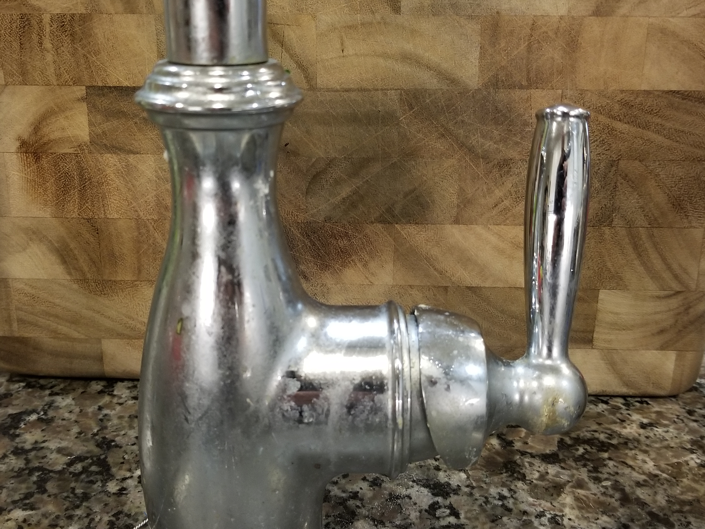

```{r setup, include=FALSE}
knitr::opts_chunk$set(echo = FALSE)
library(tidyverse)
library(gganimate)
```

## Data Communication

```{r, results = 'asis'}
cat("
<style>
.reveal section img {
  border: none !important;
  box-shadow: none;
}
</style>")
```

Welcome to Data Communication!

## Data Communication

This class is about

- How to turn data into a message
- How to cleanly communicate that message
- Technically, how to create that communication

## Media

This will largely focus on *data visualization* but will also cover:

- Exploratory data analysis
- Tables
- Notebooks
- Workflow
- Data cleaning and manipulation

## What We're Doing

- This is sort of a mutt of a class, covering coding, communications concepts, data management and cleaning, and even some analytical stuff
- That's because this is *really* a course about preparing you to go out into the real world and work with data
- The thing I really want you to come away with after this class is this:
- When you are working with data, **think carefully about what you're doing, and make sure you're doing it right.** 
- It really is just **thinking carefully** and **attending to detail**, not technical skill. This is more important than coding. We'll have to code, but code can only be as good as what you're trying to make it do

## What We're Doing

- You're going to leave the world of a classroom where the project is set up so your prof knows there *is* a right answer, what that right answer is, and they can check your work
- In the real world, *you* will be expected to produce good work on your own, which means *you'll* be checking your work, and there won't be a "wrong answer" buzzer that sounds if you make a mistake
- I want you to build enough confidence in working with data that you can look at something the computer has spit out and think "the computer only does what it's told. I know what this *should* be. This is not yet right."

## What We're Doing

So when you do **anything** with data - load a file, create a variable, make a graph, do an analysis, ask:

1. What am I **trying to do**?
1. Did it **work properly**? How can I **CHECK** if it worked properly?
1. If it's a form of communication, have you made it **as clear as possible**? Try to find places where people might get confused.

Never think "I pushed the button/wrote the line that made the thing go. I'm done." It's on you to fulfill the requirement in a way that's **good**. Take pride in your work, or it will be bad.

## What We're Doing

It takes no technical/coding skill, or extensive explanation from me, to see why this graph is bad. If you produce this graph, you should take it upon yourself to fix it. Ask: how can I improve this?

```{r, echo = FALSE, eval = TRUE, fig.height = 3, fig.width = 6}
data(gapminder, package = 'gapminder')
countries <- gapminder %>%
  pull(country) %>% 
  unique() %>%
  sort()
gapminder %>%
  filter(year == 2007) %>%
  mutate(lexp = lifeExp/max(lifeExp) + .1) %>%
  mutate(countryy_2 = as.numeric(factor(country))) %>%
  ggplot(aes(x = countryy_2, y = lexp)) + geom_line() + 
  scale_x_continuous(breaks = 1:length(countries), labels = \(x) countries[x]) +
  labs(title = 'Life expectancy compared to most')
  
```

## Admin

Let's do some housekeeping:

- Course website
- Syllabus
- Expectations and assignments

## Resources

In addition to the course website and Healy's [Data Visualization](https://kieranhealy.org/publications/dataviz/):

- The [R Graphics Cookbook](https://r-graphics.org/)
- [Data Visualization blogs](https://www.tableau.com/learn/articles/best-data-visualization-blogs)
- [LOST-STATS](https://lost-stats.github.io)
- The internet writ large
- Code for all these slides (RMarkdown and ggplot2 examples) are on the course GitHub page

## What is Data Communication?

- There is a lot of information in the world
- And a lot of information at your fingertips
- *Too much*
- And so we simplify to tell the *story* underlying the data

## What is Data Communicatoin?

- I have a **result** from my data
- I want you to **understand and believe** my result
- How can I demonstrate this result to you so you'll understand it?
- How can I present the data so that you understand where the result came from and why they should agree that the result is accurate?

## The Map and the Territory

- Someone asks you for directions to Dick's on Broadway
- Do you hand them your 3.2GB perfectly detailed shapefile of Capitol Hill?
- The answer is in there, and much more precisely than you could possibly tell them
- But it doesn't really answer their question, right?

## The Map and the Territory

- The goal of a data *analyst* is to take that shapefile and figure out how to get to Dick's
- The goal of a data communicator is to take what the data analyst figured out and figure out *what part of the map to show you to help you understand how to get to Dick's*
- A good data communicator will make understanding the directions easy and obvious

## Storytelling With Data

1. Understand the context
1. Figure out *the story* (what you want the reader to understand, and why)
1. Choose an appropriate visual display
1. Eliminate clutter
1. Focus attention where you want it
1. Think like a designer
1. Tell the story

## Examples Outside of Data

- Let's consider some examples of effective communication of information outside the narrow range of "data communication"


## How Does This Faucet Work?

```{r, out.width="650px"}

```

## Understand the context

The person who designed this faucet understands, hopefully, how water pipes work and how opening a valve can allow water to flow


## Figure out the story

*What is important for the audience to know*?

I don't care if the user understands how pipes work, or their history of water usage.

I need the user to know how to properly turn the water on


## Choose an appropriate visual display

We have a handle close to the source of the water

It implies the ways the handle can be turned - towards us or away, left and right

<div style="color:red">The display doesn't allow us any information about how those directions relate to pressure or temperature</div> (what version of a faucet might?)

## Eliminate clutter

Nothin' but handle

We could have other stuff here - sink stopper, an LCD with the weather report, but do we need it?

## Focus attention where you want it

There's nowhere to look but the handle (other than the spigot, not pictured)

The shape and design pushes you towards it - it calls for a hand!

## Think like a designer

We want the user to understand that they can pull or rotate the handle to affect the water flow

This design *affords* both of those uses

And nothing else

There aren't a lot of ways to use this wrong, other than messing up pressure vs. temperature

## Tell the story

Water flow can be controlled by twisting this handle

If you were a monkey who had never experienced plumbing, it would only take you about ten seconds to follow the design to that handle, pull it, and learn about the connection between handles and water flow

## Gapminder

- Let's move into some data
- Gapminder (from the Gapminder institute) is a data set that, among other things, shows how differences between countries change over time
- One thing it is commonly used to show is that economic development aids health development
- GDP per capita $\rightarrow$ life expectancy
- Also, generally, both of those things have improved over time

## Gapminder

```{r}
data(gapminder, package = 'gapminder')
gapminder
```

## Understand the Context

How do things work here?

- We know that life expectancy and GDP per capita go together closely

## Figure out the story

What do we want people to learn?

- GDP per capita and life expectancy go together strongly
- Both GDP per capita and life expectancy have increased a lot over time (i.e. things on this front are getting better!)

This is useful information and I can see why someone would want to understand this for its own sake, to understand the world better (and perhaps have some actionable takeaway as a result!)

## Choose an appropriate visual display

- We want something that will show a relationship between two variables with many observations
- NOW WE HAVE SOME OUTPUT. Put on those "how can we make it better?" goggles: the first output we get is NOT DONE

```{r, fig.width=6, fig.height=4}
ggplot(gapminder,
       aes(x = gdpPercap, y = lifeExp)) + 
  geom_point() + 
  labs(x = "GDP per Capita", y = "Life Expectancy")
```

## Eliminate clutter

- That's a lot of dots! Can we tell the same story by focusing on just a few countries?
- Also, that's a lot of background ink...

```{r, fig.width=6, fig.height=4}
ggplot(gapminder %>%
         filter(country %in% c('Brazil','India','Spain')),
       aes(x = gdpPercap, y = lifeExp, color = country)) + 
  geom_line() + 
  theme_minimal() +
  labs(x = "GDP per Capita", y = "Life Expectancy",
       color = 'Country') + 
  theme(legend.position = c(.8,.2),
        legend.background = element_rect())
```

## Focus attention where you want it

- Those few high-GDP observations are drawing a LOT of space, as opposed to that left blob. Let's put the x-axis on a log scale

```{r, fig.width=6, fig.height=4}
ggplot(gapminder %>%
         filter(country %in% c('Brazil','India','Spain')),
       aes(x = gdpPercap, y = lifeExp, color = country)) + 
  geom_line() + 
  theme_minimal() +
  scale_x_log10() + 
  labs(x = "GDP per Capita (log scale)", y = "Life Expectancy",
       color = 'Country') + 
  theme(legend.position = c(.8,.2),
        legend.background = element_rect())
```

## Think like a designer

- Why make the reader work?
- Also, realize this graph sort of feels like it's moving forward in time. Uh-oh...

```{r, fig.width=6, fig.height=4}
ggplot(gapminder %>%
         filter(country %in% c('Brazil','India','Spain')),
       aes(x = gdpPercap, y = lifeExp, color = country)) + 
  geom_line() + 
  theme_minimal() +
  scale_x_log10() + 
  labs(x = "GDP per Capita (log scale)", y = "Life Expectancy",
       color = 'Country') +
  annotate('text',x = 2300, y = 66, label = 'India', color = 'green') + 
  annotate('text',x = 10000, y = 68, label = 'Brazil', color = 'red') + 
  annotate('text',x = 25000, y = 75, label = 'Spain', color = 'blue') + 
  guides(color = 'none')
```

## Tell the story

- Realize that we've lost the "things get better over time" angle
- And also lost the part where we want to talk about the whole world!
- Use what we've done so far to think about how we can show the dual GDP-and-life-expectancy improvements *over time* for everyone

## What could still be improved?

```{r}
options(gganimate.dev_args = list(width = 650, height = 400))
(ggplot(gapminder,
       aes(x = gdpPercap, y = lifeExp, color = continent)) + 
  geom_point() + 
  theme_minimal() +
  scale_x_log10() + 
  labs(x = "GDP per Capita (log scale)", y = "Life Expectancy",
       title = "GDP and Life Expectancy by Country, 1952-2007",
       color = 'Continent') + 
  transition_time(year) + 
   theme(axis.title.x = element_text(size=15),
         axis.title.y = element_text(size=15),
         title = element_text(size=15))) %>%
  animate(nframes = 200,end_pause = 30)
```

## Let's See What We Can Get

- Find a "good" chart from [informationisbeautiful.net](https://informationisbeautiful.net)
- And a "bad" chart from [junkcharts.typepad.com/](https://junkcharts.typepad.com/)
- And go through our steps. What are they trying to say? How do they do it? What mistakes do they make? What is unclear?
- We will discuss


