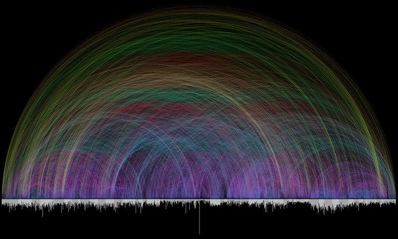
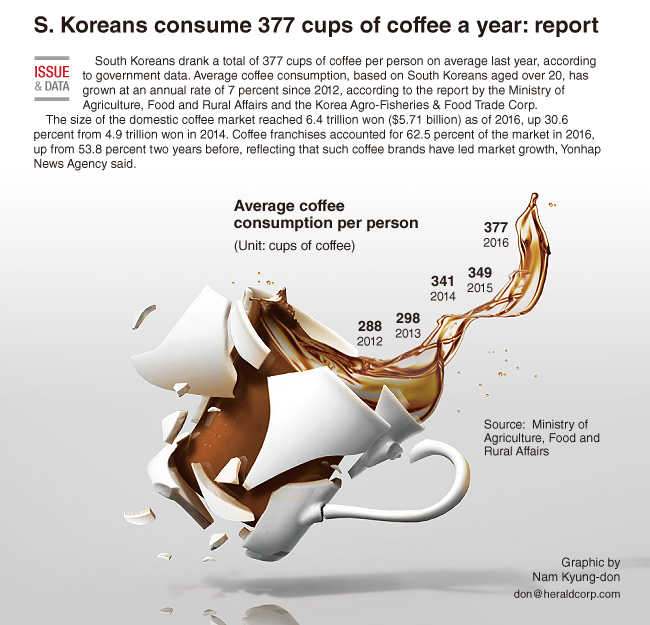
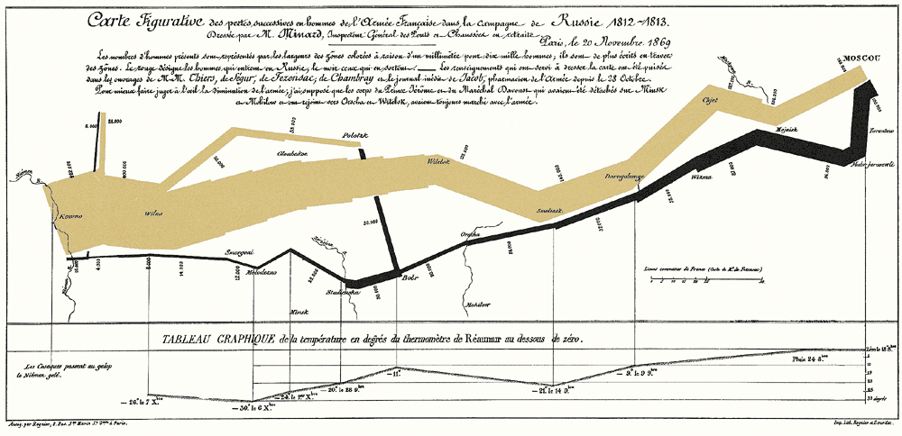

```{r setup, include=FALSE}
knitr::opts_chunk$set(echo = FALSE, warning = FALSE, message = FALSE)
library(tidyverse)
library(lubridate)
library(gghighlight)
library(ggthemes)
```


## Clutter and Focus

```{r, results = 'asis'}
cat("
<style>
.reveal section img {
  border: none !important;
  box-shadow: none;
}
</style>")
```

- We want to tell a story with our data
- Some stories are clear
- Others are complex
- They all need to be clear

## Clutter and Focus

- A common mistake is to *show you the data* rather than *show you the story*
- The story often exists within part of the data
- We want to understand some sort of *continuity* or some sort of *distinction*
- Everything that takes away from that makes the story more opaque

## Examples

- Let's look at some data visualizations that are cluttered
- Some are still *beautiful* and lovely and works of art
- Some are impressive with the amount of information they're able to get on one graph
- But they can obscure the point they're trying to make
- With each, let's think about why

## Bible Cross-References

- The following graph shows how different chapters of the bible refer to each other

---

```{r}

```

## Coffee

- How much coffee do South Koreans drink?
- Simple question, right?

---

```{r}

```


## Health care

- This graph just wants to get across three statistics about health care
- And how those statistics vary by state

---

```{r}
knitr::include_graphics('Lecture_02_Healthcare.png')
```

## Network Graphs

- You see a lot of *network graphs* floating around these days
- They look super cool
- But they can be hard to actually learn anything from

---

```{r}
knitr::include_graphics('Lecture_02_Network_Graph.gif')
```

## Napoleon's March

- This is considered one of the most beautiful and impressive pieces of data viz ever, about Napoleon's army during its march and retreat from Russia
- Distance from Paris, size of army, elevation, places where the army met itself...
- It absolutely tells an intricate and detailed story - but does it *tell* the story or *illustrate* it?
- Can be hard to say!

---

```{r}

```

## Clutter and Focus

- These graphs vary in quality but some common issues:
- They add things to the graph that do not need to be there or are difficult to understand
- They do not focus your attention on a single takeaway

## Clutter and Focus

- Clutter adds cognitive load - it makes your viz more difficult to understand
- There are many very low-level visual shortcuts in the human brain we can take advantage of to avoid this
- And to make sure that we can anticipate how the reader will interpret the visualization

## Gestalt Principles of Visual Perception

- Proximity
- Similarity
- Enclosure
- Closure
- Continuity
- Connection

## Proximity

- If you put things close to each other, they tend to get thought of as being associated
- And visually, they are at least visually comparable

## Proximity

|           | Budget  |
|-----------|---------|
|  Sales    |  $10000 |
| Marketing | $15000  |
|           |         |
| R&D       | $5000   |
| HR        | $6000   |

## Similarity

- Simply put, things that are made similar in some way (shape, color, shade, etc.) are part of the same whole

Note on using color for this: Remember colorblindness!

- Most common is red/green/(orange), blue/yellow also relatively common
- When picking colors, avoid having your contrasts be red/green or blue/yellow. Red/blue is a popular choice here.
- For complete accessibility, focus on highly contrasting *shades*
- Colorblind-friendly palettes are available!

## Similarity

```{r}
data(mtcars)
mtcars <- mtcars %>%
  mutate(Transmission = case_when(
    am == 0 ~ 'Automatic',
    am == 1 ~ 'Manual'
  ))
ggplot(mtcars, aes(x = wt, y = mpg, color = Transmission))+
  geom_point() + 
  theme_minimal() + 
  labs(x = 'Car Weight',
       y = 'Mileage (MPG)',
       color = 'Transmission Type')
```

## Enclosure

- If you put a physical enclosure around some things, they will be perceived as being part of a group
- This can be especially handy if you're already using some other forms of similarity, or need to indicate areas that WOULD be part of that group if you had data there.

## Enclosure

```{r}
knitr::include_graphics('Lecture_02_Unemployment.png')
```

## Continuity

- When there are gaps, we tend to "fill in" in the most intuitive way

## Continuity

- This year-on-year change graph has a gap at Feb. 29. But what does our brain do?

```{r, fig.height = 4}
set.seed(1000)
# Seven-day moving average
ma <- function(x,n=7){as.numeric(stats::filter(as.ts(x),rep(1/n,n), sides=1))}
tb1 <- tibble(dayofyr = 0:90,Day = ymd('2020-01-01'),Sales2020 = ma(runif(91,min=.5,max = .6))) %>%
  mutate(Day = Day + days(dayofyr)) %>%
  mutate(Mon = month(Day),
         DoM = day(Day))
tb2 <- tibble(dayofyr = 0:89,Day = ymd('2019-01-01'),Sales2019 = ma(runif(90,min=.47,max=.57))) %>%
  mutate(Day = Day + days(dayofyr)) %>%
  mutate(Mon = month(Day),
         DoM = day(Day)) %>%
  select(-dayofyr, -Day)
graphdat <- tb1 %>%
  left_join(tb2,by=c('Mon','DoM')) %>%
  mutate(YOY = (Sales2020/Sales2019) - 1)

ggplot(graphdat, aes(x = Day, y = YOY)) + 
  geom_line() + 
  labs(y = "Year-on-Year Change",
       title = "Changes in Sales Year-to-Year") + 
  theme_minimal() + 
  scale_y_continuous(labels = scales::percent)
```

## Connection

- If you put a literal connection between two points, people will interpret them as being connected!
- No big surprise
- See any line graph for this.
- This is also a good reason *not* to use a line graph when your x-axis doesn't have an order to it!

## How?

- With these concepts in mind, how can we use them to emphasize information?
- And improve clarity
- Let's begin with a first-pass graph and improve it as we can
- Let's tell a story about how Washington's 4th graders fare in math vs. other coastal states

## State NAEP Test Scores

```{r}
naep <- read_csv('Lecture_02_NAEP.csv')
ggplot(naep,
       aes(x = StateCode, y = Score)) +
  geom_col() + 
  theme(axis.text.x = element_text(angle = 90, hjust = 1, vjust = -.1)) + 
  labs(title = "Fourth Grade Math NAEP Score by State",
        x = "State",
        y = "4th Grade Math NAEP")
```

## Ordering Information

- Information should be presented in an order that highlights the information of interest
- Comparisons should be easy to make
- Ask: what should be comparable?
- We should be able to tell "more" or "less" test score
- We use *proximity* to make more-similar scores go together

## Proximity: Example

```{r}
ggplot(naep %>%
         arrange(Score) %>%
         mutate(StateCode = factor(StateCode, levels = .$StateCode)),
       aes(x = StateCode, y = Score)) +
  geom_col() + 
  theme(axis.text.x = element_text(angle = 90, hjust = 1, vjust = -.1)) + 
  labs(title = "Fourth Grade Math NAEP Score by State",
        x = "State",
        y = "4th Grade Math NAEP")
```

## Using similarity

- We may be interested in comparing Washington vs. other coastal states and saying something about the difference.
- We can do this easily by giving all the coastal states a similar *something*
- With bar graphs, an obvious pick is color

## Similarity: Example

```{r}
ggplot(naep %>%
         arrange(Score) %>%
         mutate(StateCode = factor(StateCode, levels = .$StateCode),
                Coastal = factor(Coastal, labels = c('Not Coastal','Coastal'))),
       aes(x = StateCode, y = Score, fill = Coastal)) +
  geom_col() + 
  theme(axis.text.x = element_text(angle = 90, hjust = 1, vjust = -.1)) + 
  labs(title = "Fourth Grade Math NAEP Score by State",
        x = "State",
        y = "4th Grade Math NAEP")
```

## Clarity

- We have our comparison clarified
- Let's see what else we can do with this graph

## Slices of Data

- What data is important to our story, and what data is not?
- We are interested in comparing Washington to other coastal states, why do we need all these other states
- Chuck 'em!
- This will also give us room to rotate those axis labels

## Clarity

```{r}
ggplot(naep %>%
         arrange(Score) %>%
         mutate(StateCode = factor(StateCode, levels = .$StateCode)) %>%
         filter(Coastal == 1),
       aes(x = StateCode, y = Score)) +
  geom_col() + 
  labs(title = "Fourth Grade Math NAEP Score by State",
        x = "State",
        y = "4th Grade Math NAEP")
```

## Clarity

- And dare we?
- It's a debate as to whether it ever makes sense for your $y$-axis not to start at zero. But here it's really making things hard to see. Clarity could be improved by starting the axis at, say, 100!
- We will leave this as-is, but it might imply something to think about for improvement in the future


## Contrast

- We can use contrast to make Washington stand out again
- Use a light color for others so they fade more into the back


## Contrast

```{r}
ggplot(naep %>%
         arrange(Score) %>%
         mutate(StateCode = factor(StateCode, levels = .$StateCode)) %>%
         filter(Coastal == 1),
       aes(x = StateCode, y = Score)) +
  geom_col() +  
  labs(title = "Fourth Grade Math NAEP Score by State",
        x = "State",
        y = "4th Grade Math NAEP") + 
  gghighlight(StateCode == 'WA')
```

## Simplify

- Enclosure allows us to get rid of a lot of the borders
- And we an remove the backing ink too

## Simplify

```{r}
ggplot(naep %>%
         arrange(Score) %>%
         mutate(StateCode = factor(StateCode, levels = .$StateCode)) %>%
         filter(Coastal == 1),
       aes(x = StateCode, y = Score)) +
  geom_col() + 
  labs(title = "Fourth Grade Math NAEP Score by State",
        x = "State",
        y = "4th Grade Math NAEP") + 
  gghighlight(StateCode == 'WA') + 
  theme_tufte()
```

## Easily Following Information

- Especially with long text labels, horizontal bar charts are much easier to read and compare

## Easily Following Information

```{r}
ggplot(naep %>%
         arrange(Score) %>%
         mutate(StateCode = factor(StateCode, levels = .$StateCode),
                State = factor(State, levels = .$State)) %>%
         filter(Coastal == 1),
       aes(x = StateCode, y = Score)) +
  geom_col() + 
  labs(title = "Fourth Grade Math NAEP Score by State",
        x = "State",
        y = "4th Grade Math NAEP") + 
  gghighlight(StateCode == 'WA') + 
  theme_tufte() + 
  coord_flip()
```

## Label Data Directly

- Why make the reader work? Put the label right where it's needed
- Also, remove the cognitive steps of translating the markers

## Label Data Directly

```{r}
ggplot(naep %>%
         arrange(Score) %>%
         mutate(StateCode = factor(StateCode, levels = .$StateCode),
                State = factor(State, levels = .$State)) %>%
         filter(Coastal == 1),
       aes(x = StateCode, y = Score)) +
  geom_col(fill = 'blue') + 
  geom_text(aes(label = State, x = StateCode, y = Score + 3), hjust = 0) +
  scale_y_continuous(limits = c(0,300)) + 
  labs(title = "Fourth Grade Math NAEP Score by State",
        x = "State",
        y = "4th Grade Math NAEP") + 
  gghighlight(StateCode == 'WA') + 
  theme_tufte() + 
  coord_flip() + 
  theme(axis.text.y = element_blank(),
        axis.ticks.y = element_blank())
```

## Now - Your Turn!

- You'll be creating a graph by hand
- Think carefully about how to make data comparable
- And how to contrast as needed
- And how to tell the story

## Your Turn

- Story: Sales and Marketing may be more expensive, but they haven't grown as much as R&D and HR.


```{r}
df <- read.csv(text="Dept:	Sales	Marketing	R&D	HR
2018	10000	15000	5000	6000
2019	10500	15000	7200	6500
2020	10600	16000	9300	8000",sep='\t')

df %>%
  knitr::kable(caption = 'Costs in thousands of dollars by department by year',
               format = 'html') %>%
  kableExtra::kable_styling(bootstrap_options = 'striped')
```

