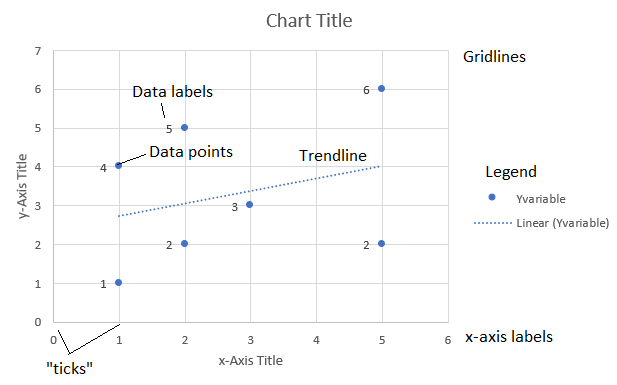
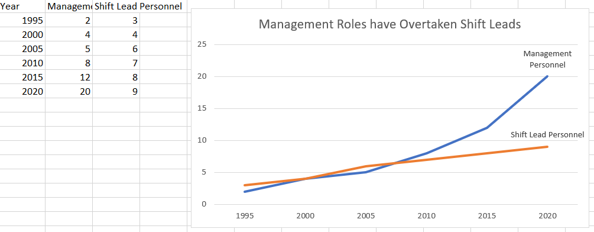

```{r setup, include=FALSE}
knitr::opts_chunk$set(echo = FALSE, warning = FALSE, message = FALSE)
library(tidyverse)
# devtools::install_github("hadley/emo")
library(emo)
```


## Graphics in Excel

```{r, results = 'asis'}
cat("
<style>
.reveal section img {
  border: none !important;
  box-shadow: none;
}
</style>")
```

- Excel is not the most flexible graphics tool
- And beyond the basics, it's pretty hard to work with
- But you gotta know it for a business environment
- And it's a great place to think design-first, not tech-first

## Graphics in Excel

Some things about Excel graphs

- Spreadsheets are very flexible
- No paper trail `r emo::ji('disappointed')`
- Point-by-point customization, drag-and-drop, and WYSIWYG
- A bit of headache with lots of data

## The Steps

- Decide on the kind of graph you want
- Prepare your data in the format Excel likes it for that graph
- Add desired chart elements
- <span style = "color:red">Format</span> (next time)

## Working with Spreadsheets

- Generally, Excel wants to see one row of data per data point on your graph
- If there's only one axis of data (say, a count of categories or histogram), one column
- If there are two axes (say, a scatterplot), two columns
- Grouped bar chart, three+ columns

## Working with Spreadsheets

- So getting things into shape is mostly standard Excel stuff
- With perhaps a Sort thrown in at the end if the data should be in a certain order

## Envisioning Your Data

- Think carefully about the data points you want
- Points on a line or scatterplot graph
- Bar heights
- A count across categories
- This will give you a target to aim for. If you can shape your data into it, you're good!

## Fancy Functions

- For extracting summary point values to graph, or particular values, we may want to use
- `VLOOKUP`
- Control-shift-enter `IF` functions like `=MEAN(IF(A2:A10="Yes",B2:B10))` to get the mean of B when column A is "Yes"

## Preparing Data

- Let's go into Excel
- Set up what data should look like in a one-column or two-column format
- And go through how to use `VLOOKUP` and Control-shift-enter `IF`

## VLOOKUP

- `=VLOOKUP(value,data,column)` looks for the row with `value` in `data`, then returns the `column` column of that data

| A | B | C | D |
|---|---|---|---|
| 1 | 2 | 3 | 4 |
| 5 | 13 | 7 | 8 |
| 9 | 10|11 |12 |

`=VLOOKUP(5,A1:D3,3)` would give...?

## Answer

| A | B | C | D |
|---|---|---|---|
| 1 | 2 | 3 | 4 |
| 5 | 13 | 7 | 8 |
| 9 | 10|11 |12 |

`=VLOOKUP(5,A1:D3,3)` would give `7`

## CONTROL-SHIFT-ENTER IF

- When you input an equation with control-shift-enter it becomes a *vector equation* where it performs the same operation on many rows to return one result

| A | B | C | D |
|---|---|---|---|
| 1 | 2 | 3 | 4 |
| 5 | 13 | 7 | 8 |
| 1 | 10|11 |12 |

- `=AVERAGE(IF(A1:A3 = 1, B1:B3))` entered with control-shift enter would give...?

## Answer

- When you input an equation with control-shift-enter it becomes a *vector equation* where it performs the same operation on many rows to return one result

| A | B | C | D |
|---|---|---|---|
| 1 | 2 | 3 | 4 |
| 5 | 13 | 7 | 8 |
| 1 | 10|11 |12 |

- `=AVERAGE(IF(A1:A3 = 1, B1:B3))` entered with control-shift enter would give `(2+10)/2 = 6`

## Your Goal

- You want the data for your graph to be set in its own area
- Perhaps its own worksheet
- This will make it clear what your graph is actually doing

## Graphing

- Now that you have your data in place, you can Insert a graph!
- It may suggest some graph types
- Let's look through our options for standard graph types in Excel
- There are sometimes paid packages available online for more types

## Types of Charts

- Let's go through basic examples of every chart in the basic set!
- To avoid: anything radial or 3-D
- What kinds of stories might each of these tell?

## Adding Chart Elements

- Once we have our graph we can modify its layout in several ways
- Quick Layout gives some template layouts
- Add Chart Element lets us add... chart elements

## Adding Chart Elements

- Adding and removing both relevant here!
- First let's learn some lingo - this will pop up repeatedly

## Adding Chart Elements

```{r}

```

## Respect Axes!

```{r}
knitr::include_graphics('Bad_Viz/Bad_X_axis.jpg')
```

## Respect Axes!

```{r}
knitr::include_graphics('Bad_Viz/Bad_Y_axis.png')
```

## And in Excel

- Then see all of our options in Excel
- Let's also look through all our available elements
- Let's try to apply our decluttering

## Additional Guides

- Some elements are not in Add Chart Element but are on the Format tab
- Text boxes (for annotation), arrows
- Anything that goes "on top of" the graph itself
- Your expected Word-style formatting for annotations
- You may also need to revisit Select Data

## Now You

- Replicate this graph (Hint: data label the last point)
- Then, customize it as you think appropriate
- Then, make a new different kind of graph to tell the same story

```{r, fig.width = 7, fig.height= 4}

```
