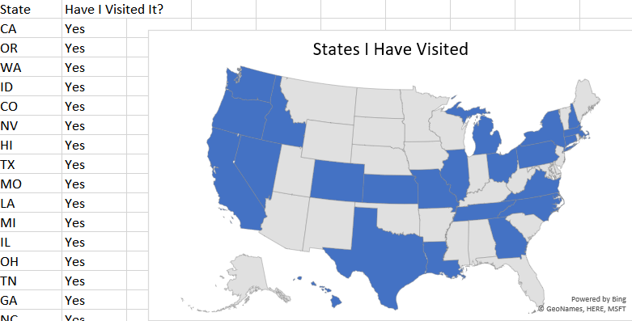
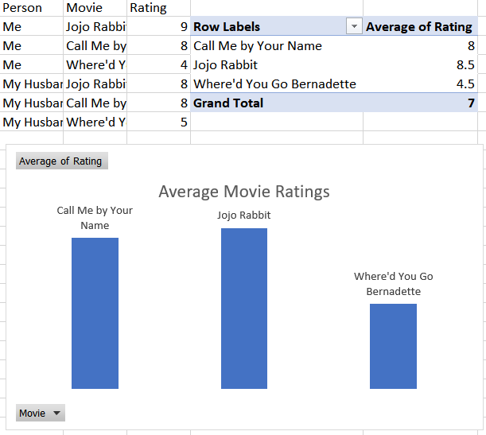
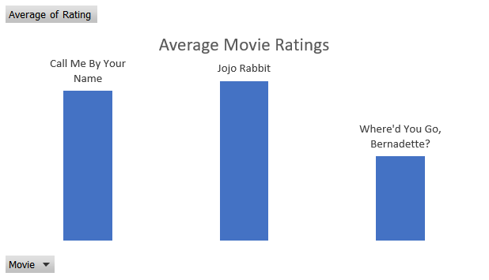
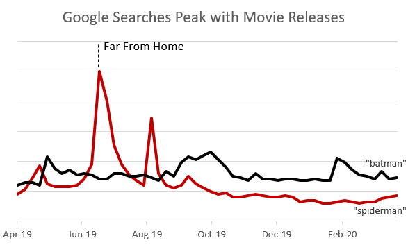
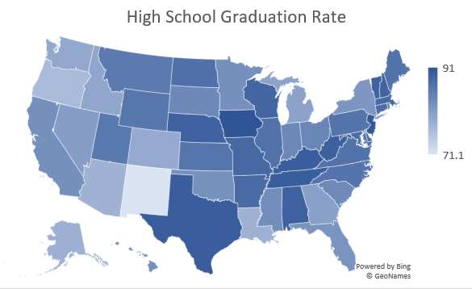
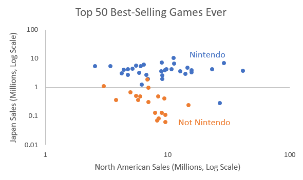

```{r setup, include=FALSE}
knitr::opts_chunk$set(echo = FALSE, warning = FALSE, message = FALSE)
library(tidyverse)
# devtools::install_github("hadley/emo")
library(emo)
```


## Styling in Excel

```{r, results = 'asis'}
cat("
<style>
.reveal section img {
  border: none !important;
  box-shadow: none;
}
</style>")
```

- As we've discussed before, styling is very important!
- We want our graphs to be de-cluttered, with good focus
- Some of that comes default but not all of it!

## Styling in Excel

- Once a graph is created, formatting options are available on the "Format" tab
- You can also double-click most elements of the graph to bring up formatting for it


## Elements

```{r}
knitr::include_graphics('Lecture_04_Excel_Example.png')
```

## Data Labels

- One thing to remember is that you have the ability to add data labels
- These can be useful ways of marking your data in some contexts


## Styling Tips

- Avoid getting too flashy - 3D, gradient fills
- Clean, simple
- Distinct colors
- Think through our principles, don't take Excel's word for it!

## Maps

- Two other thing to cover - maps and pivot graphs!
- Excel makes maps super easy
- Usually in making maps with data you need to mess with "shape files" and "chloropleths"
- And a lot of wrangling matching up data with location
- But in Excel you just sort of write the names of the places and it can generally guess what you want!

## Maps

```{r}

```

## Pivot Graphs

- Pivot charts and graphs will let you summarize data and do things like get sums or averages within group
- This will let you avoid some of the Control-Shift-Enter stuff we talked about last time
- Pivot graphs roll a pivot table right into a graph

---

```{r}

```

## Imitation and Flattery

- It's hard to do better in terms of learning where this stuff is than just doing it
- I will be showing you a series of graphs
- Your goal is to replicate them!
- Data is available on the class website for download. Each graph is a different sheet

## Imitation and Flattery

```{r}

```

## Imitation and Flattery 

```{r}

```

## Imitation and Flattery 

```{r}

```

## Imitation and Flattery 

Hard mode!

```{r}

```