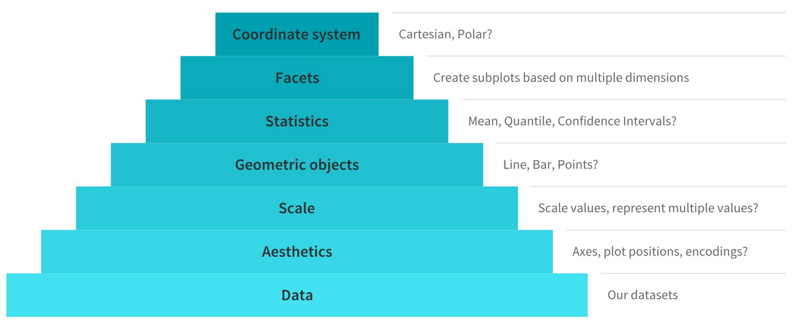

```{r setup, include=FALSE}
knitr::opts_chunk$set(echo = FALSE, warning = FALSE, message = FALSE)
library(tidyverse)
```


## What is ggplot2?

```{r, results = 'asis'}
cat("
<style>
.reveal section img {
  border: none !important;
  box-shadow: none;
}
</style>")
```

- **ggplot2** is a package in R, `library(ggplot2)` or `library(tidyverse)`
- It is based on the *grammar of graphics*
- Lots of major publications use it (538, The Economist, BBC, ...)
- Zillions of extensions for doing anything you like
- (also runs in Python using **plotnine**, although a little limited)

## Resources

- [An overview of the Grammar of Graphics concept](https://towardsdatascience.com/a-comprehensive-guide-to-the-grammar-of-graphics-for-effective-visualization-of-multi-dimensional-1f92b4ed4149)
- [ggplot2 cheat sheet from RStudio](https://rstudio.com/wp-content/uploads/2015/03/ggplot2-cheatsheet.pdf)
- [ggplot2 book by Hadley Wickham](https://ggplot2-book.org/)
- [Data Visualization by Kieran Healey](http://socviz.co/)
- [R Graphics Cookbook](https://r-graphics.org/)
- The **esquisse** or **swirlr** packages for learning **ggplot2**

## Why use ggplot?

- Huge amounts of power and flexibility
- Manipulating data easy in R
- Easy to edit
- Handles multidimensional data effortlessly

## Tidy Tuesday

- Every week, the R for Data Science community posts a data set you can use
- An assignment for this class will be to participate in (some) Tidy Tuesday weeks
- See the repository [here](https://github.com/rfordatascience/tidytuesday)
- Now on to **ggplot2**!

## The Grammar of Graphics

- There's a method here!
- We want to describe graphics in the way we use language
- Think about syntax and nouns and verbs
- We can build a plot from the ground up, element by element
- This also makes it easy to make changes or switch things out

## Components of the Grammar of Graphics

```{r}
# https://towardsdatascience.com/a-comprehensive-guide-to-the-grammar-of-graphics-for-effective-visualization-of-multi-dimensional-1f92b4ed4149

```

## Components of the Grammar of Graphics

- Data: Identify the dimensions you want to visualize. Prepare data so that it contains the points you want to visualize, or calculate from
- Aesthetics: Axes are based on the data dimensions. Also includes other "axes" like size, shape, color, etc.
- Scale: Do we need to scale the potential values, use a specific scale to represent multiple values or a range?

## Components of the Grammar of Graphics

- Geometric objects (`geom_`s): How should the data be drawn on the graph? Lines? Points? Bars?
- Statistics: Do we want to show calculations based on data rather than data itself?
- Facets: Do we want to spread one of the "axes" across multiple graphs?
- Coordinate system: Should it be cartesian or polar (or something else)? Flipped? Log scale?

## Setting up a ggplot Graph

We can focus, at least to start, on:

- Data
- Aesthetic
- Geometry

## Data

- Data is just a regular data set (`data.frame` or `tibble`) as you'd normally work with it in R.
- **ggplot2** is set up to work directly with data frames. References to variables will look in the dataset you give it

## Aesthetic

- The *aesthetic* determines the "axes" of our graph
- Literally the `x=` and `y=` axes, but also other axes on which data is differentiated, like `color=`, `size=`, `linetype=`, `fill=`, etc.
- `aes(x=mpg,y=hp,color=transmission)` puts the `mpg` variable on the x-axis, `hp` on the y-axis, and colors things differently by `transmission`
- `group=` to separate groups for things like labeling without making them visibly different
- Different aesthetic values for different types of graphs/geometries

## For Example

```{r, echo = TRUE, fig.height = 4, fig.width = 6}
library(tidyverse)
mtcars <- mtcars %>%
  mutate(Transmission = factor(am, labels = c('Automatic','Manual')),
         CarName = row.names(mtcars))
ggplot(mtcars, aes(x = mpg, y = hp, color = Transmission)) + 
  geom_point()
```


## Geometry

- The *geometry* is what actually gets drawn. In the last slide, `geom_point()` drew points.
- There are many different geometries. Let's look at the [ggplot2 cheat sheet](https://rstudio.com/wp-content/uploads/2015/03/ggplot2-cheatsheet.pdf)
- Common: `geom_point`, `geom_line`, `geom_bar`, `geom_text`

## Geometry: geom_line

```{r, echo = TRUE, fig.height = 4, fig.width = 6}
data(economics)
ggplot(economics, aes(x = date, y = uempmed)) + 
  geom_line()
```


## Geometries: geom_text

```{r, echo = TRUE, fig.height = 4, fig.width = 6}
ggplot(mtcars, aes(x = mpg, y = hp, color = Transmission, label = CarName)) + 
  geom_text()
```

## Explicit bar graphs like Excel: geom_col

```{r, echo = TRUE, fig.height = 4, fig.width = 6}
data <- tibble(category = c('Apple','Banana','Carrot'),
               quality = c(6,4,3))
ggplot(data, aes(x = category,y=quality)) + geom_col()
```

## Or explicit grouped charts: geom_col

```{r, echo = TRUE, fig.height = 4, fig.width = 6}
data <- tibble(category = c('Apple','Banana','Carrot','Apple','Banana','Carrot'),
               person = c('Me','Me','Me','You','You','You'),
               quality = c(6,4,3,1,6,3))
ggplot(data, aes(x = person, y = quality, fill = category)) + geom_col(position = 'dodge')
```


## Calculations

- Some geometries do calculations/summaries of your data before graphing
- Common: `geom_density`/`geom_histogram`/`geom_dotplot`, `geom_bar`, `geom_smooth`

## Demonstrating Distributions

```{r, echo = TRUE, fig.height = 4, fig.width = 6}
ggplot(mtcars, aes(x = mpg)) + geom_density()
```

## Demonstrating Distributions

```{r, echo = TRUE, fig.height = 4, fig.width = 6}
ggplot(mtcars, aes(x = mpg)) + geom_histogram()
```

## Demonstrating Distributions

```{r, echo = TRUE, fig.height = 4, fig.width = 6}
ggplot(mtcars, aes(x = mpg)) + geom_dotplot()
```

## Discrete Distributions: geom_bar

```{r, echo = TRUE, fig.height = 4, fig.width = 6}
ggplot(mtcars, aes(x = Transmission)) + geom_bar()
```

## Best-fit lines with geom_smooth

```{r, echo = TRUE, fig.height = 4, fig.width = 6}
ggplot(mtcars, aes(x = mpg, y = hp)) + 
  geom_point() + geom_smooth()
```

## Trendlines with geom_smooth

```{r, echo = TRUE, fig.height = 4, fig.width = 6}
# Or make it straight, and separate by Transmission, and no bands
ggplot(mtcars, aes(x = mpg, y = hp, color = Transmission)) + 
  geom_point() + geom_smooth(method = 'lm', se = FALSE)
```

## Imitation and Flattery

- Uses `data(iris)`

```{r, fig.height = 4, fig.width=6}
ggplot(iris, aes(x = Sepal.Width, y = Sepal.Length, color = Species)) + 
  geom_point()
```

## Imitation and Flattery

- Uses `data(economics_long)`
- `economics_long <- economics_long %>%` `filter(variable %in% c('psavert','uempmed'))` keeps just the two variables we want

```{r, fig.height = 4, fig.width=6}
data(economics_long)
economics_long <- economics_long %>% filter(variable %in% c('psavert','uempmed'))
ggplot(economics_long, aes(x = date, y = value, linetype = variable)) + 
  geom_line()
```

## Imitation and Flattery

- Uses `data(economics)`

```{r, fig.height = 4, fig.width=6}
data(economics)
ggplot(economics, aes(x = uempmed)) + geom_density()
```

## Moving Forward

- Everything we've done up to now isn't all *that* different from any sort of graphing software
- But what really makes **ggplot2** shine is its consistency and internal logic
- You'll have full access to the *scales* of the graph, as well as to the components that make it up
- And manipulating those things is fairly intuitive to do rather than head-banging work
- That's what we'll work on next time!