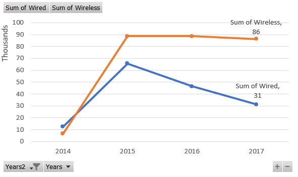

```{r setup, include=FALSE}
knitr::opts_chunk$set(echo = FALSE, warning = FALSE, message = FALSE)
library(tidyverse)
library(knitr)
library(paletteer)
library(ggrepel)
library(directlabels)
library(gghighlight)
library(lubridate)

rinlinevarname <- function(code){
  html <- '<code  class="r">``` `CODE` ```</code>'
  sub("CODE", code, html)
}
```


## As Class Continues!

```{r, results = 'asis'}
cat("
<style>
.reveal section img {
  border: none !important;
  box-shadow: none;
}
</style>")
```

- What else do we have in class?
- We're going to cover Tableau
- And also get in plenty of practice
- And we will cover some best-practices for common data communication issues
- Plus our project!

## As Class Continues

- Today and next time we'll be focusing on two common graph types
- Line graphs today and scatterplots next time
- We will discuss some best-practices, tips and tricks
- And then try them out ourselves more directly

## As Class Continues

- Then we'll dip into Tableau for a bit, and come back out to focus on more graph types
- At that point class will be a bit of lecture at the start to cover some ground
- And then hands-on work with data and visualization
- There's no substitute for "getting a feel for it."

## Line Graphs

- Line graphs: for what?
- Line graphs are good for one-to-one relationships between the x and y axis
- One x in, one y out $\rightarrow$ a bunch of x in, one line out
- Almost always x is in consistent discrete jumps (i.e. 1 2 3 not 1 3 100)
- Often, x is time

## Line Graphs

- What kind of stories can we tell with line graphs?
- Change over time
- When change occurred
- How different groups change (multiple line graphs on the same axes)

## Aesthetics

- How can we draw focus with line graphs (and what stories get told)?
- Color, size, linetype
- Select colors to tell a story (bad = red/good = blue perhaps)
- Data points
- Highlighting
- Vertical and horizontal lines
- Callouts

## Color, Size, Linetype

- These are ways of distinguishing multiple lines
- Dashed generally indicates "less" - less important, less certain

```{r, echo = FALSE, fig.height=4, fig.width=7}
data(gapminder, package='gapminder')
gapminder %>% 
  filter(country %in% c('United States','Canada','Mexico')) %>%
  ggplot(aes(x =year, y = lifeExp, group = country, color = country == 'United States',
             linetype = country != 'United States',
             size = country == 'United States')) + 
  geom_line() +
  scale_size_manual(values = c(1,2)) + 
  labs(x = 'Year',
       y = 'Life Expectancy',
       title = 'North American Life Expectancy') + 
  theme_minimal() + 
  guides(linetype = FALSE,
         color=FALSE,size=FALSE)

```

## Colors tell a story too

- Consider color choice for "good" or "bad" messages
- We also add a callout here too

```{r, echo = FALSE, fig.height=4, fig.width=7}
gapminder %>% 
  filter(country %in% c('United States','Canada')) %>%
  ggplot(aes(x =year, y = lifeExp, group = country, color = country == 'United States',
             linetype = country != 'United States',
             size = country == 'United States')) + 
  geom_line() +
  scale_size_manual(values = c(1,2)) + 
  scale_color_manual(values=c('blue','red'))+
  labs(x = 'Year',
       y = 'Life Expectancy',
       title = 'North American Life Expectancy') + 
  theme_minimal() + 
  guides(linetype = FALSE,
         color=FALSE,size=FALSE) +
  annotate(geom='label',x=1960,y=76,label='Starting from similar levels,\nUSA life expectancy grows\nslower than Canada.')

```

## Labeling Data Points

- Don't necessarily go whole-hog, but think about what's important and maybe label that!

```{r, echo = FALSE, fig.height=4, fig.width=7}
gapminder %>% 
  filter(country %in% c('United States','Canada')) %>%
  ggplot(aes(x =year, y = lifeExp, group = country, color = country == 'United States',
             linetype = country != 'United States',
             size = country == 'United States')) + 
  geom_line() +
  geom_text_repel(data = gapminder %>% 
  filter(country %in% c('United States','Canada')) %>%
    group_by(country) %>%
    filter(year == min(year)),aes(label=scales::number(lifeExp,accuracy=.1)),hjust=0,size=4)+
  geom_text_repel(data = gapminder %>% 
  filter(country %in% c('United States','Canada')) %>%
    group_by(country) %>%
    filter(year == max(year)),aes(label=scales::number(lifeExp,accuracy=.1)),hjust=1,size=4)+
  scale_size_manual(values = c(1,2)) + 
  scale_color_manual(values=c('blue','red'))+
  scale_x_continuous(limits=c(1945,2010))+
  scale_y_continuous(limits=c(65,82))+
  labs(x = 'Year',
       y = 'Life Expectancy',
       title = 'North American Life Expectancy') + 
  theme_minimal() + 
  guides(linetype = FALSE,
         color=FALSE,size=FALSE) +
  annotate(geom='label',x=1960,y=76,label='Starting from similar levels,\nUSA life expectancy grows\nslower than Canada.')

```

## Labeling Lines

- Rather than a legend, I almost 100% of the time put the title of a line somewhere on the line itself

```{r, echo = FALSE, fig.height=4, fig.width=7}
gapminder %>% 
  filter(country %in% c('United States','Canada')) %>%
  ggplot(aes(x =year, y = lifeExp, group = country, color = country == 'United States',
             linetype = country != 'United States',
             size = country == 'United States')) + 
  geom_line() +
  geom_text_repel(data = gapminder %>% 
  filter(country %in% c('United States','Canada')) %>%
    group_by(country) %>%
    filter(year == min(year)),aes(label=scales::number(lifeExp,accuracy=.1)),hjust=0,size=4)+
  geom_dl(aes(label = country),method='last.bumpup')+
  scale_size_manual(values = c(1,2)) + 
  scale_color_manual(values=c('blue','red'))+
  scale_x_continuous(limits=c(1945,2016))+
  scale_y_continuous(limits=c(65,82))+
  labs(x = 'Year',
       y = 'Life Expectancy',
       title = 'North American Life Expectancy') + 
  theme_minimal() + 
  guides(linetype = FALSE,
         color=FALSE,size=FALSE) +
  annotate(geom='label',x=1960,y=76,label='Starting from similar levels,\nUSA life expectancy grows\nslower than Canada.')

```

## Highlighting

- Lots of lines is tricky, but if you do do it, it NEEDS highlighting

```{r, echo = FALSE, fig.height=4, fig.width=7}
gapminder %>% 
  filter(continent %in% 'Americas') %>%
  ggplot(aes(x =year, y = lifeExp, color = country)) + 
  geom_line(size=1.5) +
  gghighlight(country %in% c('United States','Canada','Mexico'))+
  scale_x_continuous(limits=c(1945,2010))+
  labs(x = 'Year',
       y = 'Life Expectancy',
       title = 'North American Life Expectancy vs. All Americas') + 
  theme_minimal() + 
  guides(linetype = FALSE,
         color=FALSE,size=FALSE) +
  annotate(geom='label',x=1960,y=76,label='Among all American countries,\nNorth Americans have higher\nlife expectancy.')
```

## Vertical and Horizontal Lines

- Very easy ways to read a split in time, or crossing a threshold

```{r, echo = FALSE, fig.height=4, fig.width=7}
gapminder %>% 
  filter(continent %in% 'Americas') %>%
  ggplot(aes(x =year, y = gdpPercap, color = country)) + 
  geom_line(size=1.5) +
  gghighlight(country %in% (gapminder %>% 
                filter(continent %in% 'Americas') %>%
                filter(year == max(year)) %>% 
                filter(gdpPercap > 15000) %>% 
                distinct() %>% pull(country) %>%
                as.character()))+
  scale_y_continuous(labels=scales::dollar)+
  geom_hline(aes(yintercept=15000),linetype='dashed')+
  labs(x = 'Year',
       y = 'GDP Per Capita',
       title = 'GDP per Capita in American Countries') + 
  theme_minimal() + 
  guides(color=FALSE) +
  annotate(geom='label',x=1965,y=40000,label='Very few American countries\nbreak the $15,000 barrier.')
```

## Vertical and Horizontal Lines

- Very easy ways to read a split in time, or crossing a threshold

```{r, echo = FALSE, fig.height=4, fig.width=7}
gapminder %>% 
  filter(country %in% c('United States','Canada','Mexico')) %>%
  ggplot(aes(x =year, y = gdpPercap, color = country)) + 
  geom_line(size=1.5) +
  geom_dl(aes(label=country),method='last.bumpup')+
  scale_x_continuous(limits=c(1950,2016))+
  scale_y_continuous(labels=scales::dollar)+
  geom_vline(aes(xintercept=1994),linetype='dashed')+
  annotate(geom='label',x=1994,y=20000, label = 'NAFTA Passed')+
  labs(x = 'Year',
       y = 'GDP Per Capita',
       title = 'GDP per Capita in American Countries') + 
  theme_minimal() + 
  guides(color=FALSE) +
  annotate(geom='label',x=1965,y=40000,label='Effects of NAFTA were\nnot immediate.')
```

## Common Pitfalls

- What are some common pitfalls?
- Too many lines
- Overlapping lines
- Legends
- Huge range in the y-axis (or too little range)
- Multiple y-axes
- An unordered x-axis (don't use a line graph for bar graph jobs!)
- Curved lines can give illusion of continuity if it's not there

## Excel Line Graphs

- Each line in its own column
- If you want to specify an x-axis, use a scatterplot with line connections instead of a line graph
- Use data labels with "Series Labels" on the last/first points to label the lines themselves
- Consider labeling some of the points - "Data labels" for values (make sure to format nicely!), "Data callouts" to also show x-axis
- Explore the different kinds - some show multiple lines as proportions, some stack...

## ggplot2 Line Graphs

- `geom_line()`, perhaps add dots with `geom_point`
- Add vertical and horizontal markers with `geom_vline` and `geom_hline`
- `directlabels` and `geom_dl` for labeling the lines
- Or `gghighlight` to gray out some lines and label the others
- `geom_text` to label the points, use `vjust` or `geom_text_repel` to move out of the way of the line

## Practice

- Download this file of robocall complaints to the FCC: [https://www.kaggle.com/fcc/robocall-complaints](https://www.kaggle.com/fcc/robocall-complaints)
- Load the CSV into R using `read_csv` and use dplyr to:
- Keep only Methods of "Wireless (cell phone/other mobile device)" or "Wired"
- Use `mutate` and `case_when` to rename the Wireless Method more reasonably
- Use the `mdy` function in **lubridate** to turn `r rinlinevarname("Date of Issue")` into a date
- Get the number (`n()`) of complaints **by** Date of Issue and Methods
- Write the result as a CSV with `write_csv()`.

## Practice Answers

```{r, echo = TRUE, eval = FALSE}
library(tidyverse); library(lubridate)
df <- read_csv('CGB_-_Consumer_Complaints_Data.csv')
df <- df %>%
  filter(Method %in% c('Wireless (cell phone/other mobile device)','Wired')) %>%
  mutate(Method = case_when(Method == 'Wired' ~ Method, TRUE ~ 'Wireless'),
         `Date of Issue` = mdy(`Date of Issue`)) %>%
  group_by(`Date of Issue`, Method) %>%
  summarize(`Number of Complaints` = n())
write_csv(df,'robocalls.csv')
```

```{r, echo = FALSE, eval = TRUE}
df <- read_csv('robocalls.csv')
```

## Replicate a Graph

- For this replication we'll be using smoothed data
- Since this daily data staggers up and down very quickly and is hard to see
- This works well when we want to look at things from a farther-back perspective
- But can be iffy if it lets us cover up actual non-smooth changes in the data


## Replicate this Graph!

- <span style="font-size:large">Working with **ggplot2**, and only keeping dates between Jan 1 2014 and Sept 12 2017 (hint: `mdy('01-01-2014')` and `mdy('09-12-2017')` from **lubridate**), and using `geom_smooth(se=FALSE)` and the `lisa::GeneDavis` palette, replicate this graph</span>

```{r, echo = FALSE, eval = TRUE, fig.width = 7, fig.height=5}
ggplot(df %>% filter(`Date of Issue` >= mdy('01-01-2014') & `Date of Issue` <= mdy('09-12-2017')), 
       aes(x = `Date of Issue`,y = `Number of Complaints`, color = Method)) + 
  geom_smooth(se=FALSE) + 
  theme_minimal() +
  guides(color = FALSE) +
  annotate(geom='text', x = mdy('06-01-2016'),y=325, label = 'Wireless robocalls overtook wired\nin 2015, with a big jump in 2017.') + 
  labs(x = 'Date',title = 'Robocall Complaints to Government') + 
  scale_color_paletteer_d('lisa::GeneDavis')
```


## Replicate This Graph!

```{r, echo = TRUE, eval = FALSE}
ggplot(df %>% filter(`Date of Issue` >= mdy('01-01-2014') & `Date of Issue` <= mdy('09-12-2017')), 
       aes(x = `Date of Issue`,y = `Number of Complaints`, color = Method)) + 
  geom_smooth(se=FALSE) + 
  theme_minimal() +
  guides(color = FALSE) +
  annotate(geom='text', x = mdy('06-01-2016'),y=325, label = 'Wireless robocalls overtook wired\nin 2015, with a big jump in 2017.') + 
  labs(x = 'Date',title = 'Robocall Complaints to Government') + 
  scale_color_paletteer_d('lisa::GeneDavis')
```

## Practice Graphing

- Now, working with Excel, again cut to between Jan. 1 2014 and Sept. 12 2017.
- You'll have to do a little data manipulation by hand, and a pivot chart

```{r}

```

## Graphing

- Now with whatever time we have left, see if you can come up with another interesting graph! Excel or **ggplot2**