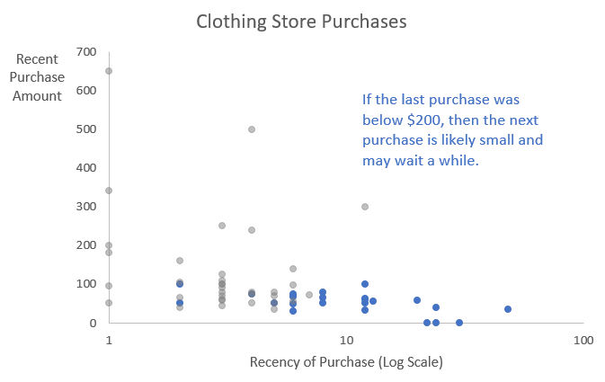

```{r setup, include=FALSE}
knitr::opts_chunk$set(echo = FALSE, warning = FALSE, message = FALSE)
library(tidyverse)
library(knitr)
library(paletteer)
library(ggrepel)
library(directlabels)
library(gghighlight)
library(lubridate)

rinlinevarname <- function(code){
  html <- '<code  class="r">``` `CODE` ```</code>'
  sub("CODE", code, html)
}
```


## Scatterplots

```{r, results = 'asis'}
cat("
<style>
.reveal section img {
  border: none !important;
  box-shadow: none;
}
</style>")
```

- Scatterplots are a very tricky kind of graph to get right
- They're the purest way to show the relationship between two continuous variables
- But they can get hard to read, messy, obtuse
- And readers can be led astray!

## Scatterplots

- Scatterplots show the relationship between two variables
- By simply plotting every observation
- The shape of the relationship between them (positive, negative, null, U-shaped, etc.) should be clear
- Use when that's your goal, explaining how two variables move together
- Can also be handy for pointing out outliers

## Scatterplots and Audience

- One thing to keep in mind is that scatterplots require a bit more *data sense* to intrepret than most graphs
- You need to be fairly familiar with data and how it moves to really understand a scatterplot at a glance
- So be careful with your audience when making a scatterplot
- For a lay audience, a scatterplot can't be the least bit ambiguous
- For a more advanced audience there can be more complexity

## Aesthetics

- How can we draw focus with scatterplots (and what stories get told)?
- Color, size, shape
- Select colors to tell a story (bad = red/good = blue perhaps)
- Data labels (or just text points)
- Opacity
- Lines and encirclings
- Callouts

## Color, size, shape, and opacity

- Basically, there are plenty of ways to decorate the dots
- But if they have to check a big ol' legend what's the point
- Also be aware, shape can be hard to distinguish
- Try to make the designations mean something!
- If different color and shape overlap a lot, they can be hard to tell apart

## Color and Shape

What's good and bad about this graph?

```{r,echo =FALSE, eval = TRUE, fig.width=7, fig.height= 5}
data(gapminder, package='gapminder')
gapminder %>%
  filter(year == 2007) %>%
  rename(Continent = continent) %>%
  ggplot(aes(x = gdpPercap, y = lifeExp, color = Continent, shape = Continent)) +
  geom_point(size = 2) + 
  scale_x_log10() +
  theme_minimal() + 
  labs(x = 'GDP per Capita (log scale)', y = 'Life Expectancy',
       title = 'GDP per Capita and Life Expectancy by Country in 2007')
```

## Size

```{r,echo =FALSE, eval = TRUE, fig.width=7, fig.height= 5}
gapminder %>%
  filter(year == 2007) %>%
  filter(continent == 'Asia') %>%
  ggplot(aes(x = gdpPercap, y = lifeExp, size = pop)) +
  geom_point(shape=1) + 
  scale_x_log10() +
  theme_minimal() + 
  labs(x = 'GDP per Capita (log scale)', y = 'Life Expectancy',
       title = 'GDP per Capita and Life Expectancy in Asia in 2007',
       caption = 'Size indicates population') + 
  guides(size = FALSE) 
```

## Size

```{r,echo =FALSE, eval = TRUE, fig.width=7, fig.height= 5}
gapminder %>%
  filter(year == 2007) %>%
  filter(continent == 'Asia') %>%
  ggplot(aes(x = gdpPercap, y = lifeExp, size = pop)) +
  geom_point(shape=1) + 
  scale_x_log10() +
  theme_minimal() + 
  labs(x = 'GDP per Capita (log scale)', y = 'Life Expectancy',
       title = 'GDP per Capita and Life Expectancy in Asia in 2007',
       caption = 'Size indicates population') + 
  guides(size = FALSE) + 
  annotate(geom='label',x = 1000, y = 43.8, label = 'Afghanistan', hjust = 0) + 
  annotate(geom='label',x=10000, y = 55,label = 'The relationship is\nclearly log-linear,\nwith the most populous\ncountries in the middle.', hjust = 0)
```

## Opacity

How else can we make Asia pop if we're trying to focus on it?

```{r,echo =FALSE, eval = TRUE, fig.width=7, fig.height= 5}
gapminder %>%
  filter(year == 2007) %>%
  rename(Continent = continent) %>%
  ggplot(aes(x = gdpPercap, y = lifeExp, color = Continent == 'Asia', alpha = Continent == 'Asia')) +
  geom_point(size = 2) + 
  scale_alpha_manual(values = c(.4,1))+
  scale_color_manual(values = c('lightblue','black'))+
  scale_x_log10() +
  theme_minimal() +
  guides(color = FALSE,alpha = FALSE) +
  labs(x = 'GDP per Capita (log scale)', y = 'Life Expectancy',
       title = 'GDP per Capita and Life Expectancy in Asian Countries in 2007')
```

## Data Labels

- We already showed with Afghanistan how we can use data labels to draw attention to certain points
- Good if we want to focus on one for the story, or if we want to explain an odd observation like Afghanistan
- We could just replace the points with text! (`geom_text` or `geom_text_repel` or similarly with labels)
- This can get messy REAL fast but can be highly informative
- Only use if the number of observations is tiny.

## Data Labels

It takes a special scenario for this to be right! This graph doesn't give us much.

```{r, echo = FALSE, eval = TRUE, fig.width=7, fig.height=5}
data(mtcars)
mtcars$cn <- row.names(mtcars)
mtcars %>%
  filter(cyl == 6) %>%
  mutate(Transmission = factor(am, labels = c('Automatic','Manual'))) %>%
  ggplot(aes(x = hp, y = mpg, color = Transmission, label = cn)) +
  geom_text_repel() + 
  theme_minimal() + 
  theme(legend.position = c(.8,.8),
        legend.background = element_rect()) + 
  labs(x = 'Horsepower',
       y = 'Miles per Gallon',
       title = 'Horsepower and Miles per Gallon in Six-Cylinder Cars')
```

## Lines and Encirclings

- In scatterplots, lines generally help partition data
- Above/below in either direction, relative to some real cutoff
- Encirclings (`geom_encircle` in **ggalt**) can be good ways of setting apart observations in a clearer way than color

## Lines and Encirclings

```{r,echo =FALSE, eval = TRUE, fig.width=7, fig.height= 5}
gapminder %>%
  filter(year == 2007) %>%
  ggplot(aes(x = gdpPercap, y = lifeExp, size = pop)) +
  geom_point(shape=1) + 
  scale_x_log10() +
  theme_minimal() + 
  labs(x = 'GDP per Capita (log scale)', y = 'Life Expectancy',
       title = 'GDP per Capita and Life Expectancy in 2007',
       caption = 'Size indicates population') + 
  guides(size = FALSE) +
  geom_vline(aes(xintercept = 1168)) + 
  annotate(geom='label',x=1168,y=80,label='$3.20/day poverty line')
```

## Lines and Encirclings

```{r,echo =FALSE, eval = TRUE, fig.width=7, fig.height= 5}
gapminder %>%
  filter(year == 2007) %>%
  ggplot(aes(x = gdpPercap, y = lifeExp, size = pop)) +
  geom_point(shape=1) + 
  scale_x_log10() +
  theme_minimal() + 
  labs(x = 'GDP per Capita (log scale)', y = 'Life Expectancy',
       title = 'GDP per Capita and Life Expectancy in 2007',
       caption = 'Size indicates population') + 
  guides(size = FALSE) +
  ggalt::geom_encircle(data = gapminder %>% filter(year == 2007,
                                                   gdpPercap > 7000,
                                                   lifeExp < 60),
                       color = 'blue') + 
  annotate(geom = 'label', x = 15000, y = 60, hjust = 0, vjust = 1,
           label = 'A small set of African\ncountries have low\nexpectancy despite\naverage GDP.')
```

## Common Pitfalls

- Too many points
- Overlapping clusters of points
- Overlapping *points* (use jitter or heatmaps for discrete scatterplots!)
- Relying heavily on shape
- Unclear takeaway

## Common Pitfalls

```{r,echo =FALSE, eval = TRUE, fig.width=7, fig.height= 5}
gapminder %>%
  rename(Continent = continent) %>%
  ggplot(aes(x = gdpPercap, y = lifeExp, color = Continent, shape = Continent)) +
  geom_point(size = 2) + 
  scale_x_log10() +
  theme_minimal() + 
  labs(x = 'GDP per Capita (log scale)', y = 'Life Expectancy',
       title = 'GDP per Capita and Life Expectancy by Country')
```

## Common Pitfalls

```{r,echo =FALSE, eval = TRUE, fig.width=7, fig.height= 5}
ggplot(mtcars, aes(x = cyl, y = carb)) + 
  geom_point(size = 2) +
  labs(x = 'Number of Cylinders',y='Number of Carburetors') + 
  theme_minimal()
```

## Discrete Scatterplots - With Jitter

```{r,echo =FALSE, eval = TRUE, fig.width=7, fig.height= 5}
ggplot(mtcars, aes(x = cyl, y = carb)) + 
  geom_jitter(size = 2,width = .25, height = .25) +
  labs(x = 'Number of Cylinders',y='Number of Carburetors') + 
  theme_minimal()
```

## Discrete or Busy Scatterplots - With Heat

```{r,echo =FALSE, eval = TRUE, fig.width=7, fig.height= 5}
gapminder %>%
  rename(Continent = continent) %>%
  ggplot(aes(x = gdpPercap, y = lifeExp)) +
  ggpointdensity::geom_pointdensity(size = 2) + 
  scale_x_log10() +
  theme_minimal() + 
  labs(x = 'GDP per Capita (log scale)', y = 'Life Expectancy',
       title = 'GDP per Capita and Life Expectancy by Country') + 
  guides(color = FALSE)
```

## Excel Scatterplots

- As long as you're not going by-group, Excel scatterplots really are as easy as:
- X and Y column,
- Insert scatterplot
- Customize
- With more than one group, you need one set of columns per group, and add Legend Series in Select Data

## ggplot2 Scatterplots

- We've done plenty of `geom_point`s
- Conveniently, things stay just about the same if we have to change the geom
- `geom_text`, `geom_jitter` are in the **tidyverse**
- Outside we get text with `geom_text_repel` or `geom_label_repel` in **ggrepel** or `geom_pointdensity` in **ggpointdensity**
- The encircling is `geom_encircle` in **ggalt**

## Practice

- The data this time doesn't require much processing
- https://vincentarelbundock.github.io/Rdatasets/csv/Stat2Data/Clothing.csv
- There's a massive outlier though, remove that!
- Using variables Amount (amount of purchase), Recency (months since last purchase), and Dollar12 ($ spent in last year)
- Using `labels=scales::dollar` on the Amount axis.


## Replicate this Graph with ggplot2!

```{r,echo =FALSE, eval = TRUE, fig.width=7, fig.height= 5}
Clothing <- read_csv('https://vincentarelbundock.github.io/Rdatasets/csv/Stat2Data/Clothing.csv')
Clothing <- Clothing %>% slice(-60)
ggplot(Clothing,
       aes(x = Recency, y = Amount, color = Dollar12 >= 200,
           alpha = Dollar12 >= 200)) + geom_point() + 
  labs(x = 'Months Since Last Purchase',
       y = "Dollar Amount of Purchase",
       title = 'Clothing Store Purchases') + 
  scale_y_continuous(labels = scales::dollar)+
  scale_color_manual(values = c('red','gray'))+ 
  scale_alpha_manual(values = c(1,.8))+
  guides(color = FALSE, alpha = FALSE) + 
  theme_minimal() +
  annotate(geom = 'label',x = 20, y =300, hjust = 0, vjust = 1,
           label = 'If the last purchase was\nbelow $200, then the next\npurchase is likely small\nand may wait a while.')

```


## Replicate This Graph!

```{r,echo = TRUE, eval = FALSE, fig.width=7, fig.height= 5}
Clothing <- read_csv('https://vincentarelbundock.github.io/Rdatasets/csv/Stat2Data/Clothing.csv')
Clothing <- Clothing %>% slice(-60)
ggplot(Clothing,
       aes(x = Recency, y = Amount, color = Dollar12 >= 200,
           alpha = Dollar12 >= 200)) + geom_point() + 
  labs(x = 'Months Since Last Purchase',
       y = "Dollar Amount of Purchase",
       title = 'Clothing Store Purchases') + 
  scale_y_continuous(labels = scales::dollar)+
  scale_color_manual(values = c('red','gray'))+ 
  scale_alpha_manual(values = c(1,.8))+
  guides(color = FALSE, alpha = FALSE) + 
  theme_minimal() +
  annotate(geom = 'label',x = 20, y =300, hjust = 0, vjust = 1,
           label = 'If the last purchase was\nbelow $200, then the next\npurchase is likely small\nand may wait a while.')

```

## Practice Graphing

- Now, working with Excel, replicate this graph:

```{r}

```

## Graphing

- Now with whatever time we have left, see if you can come up with another interesting graph! Excel or **ggplot2**