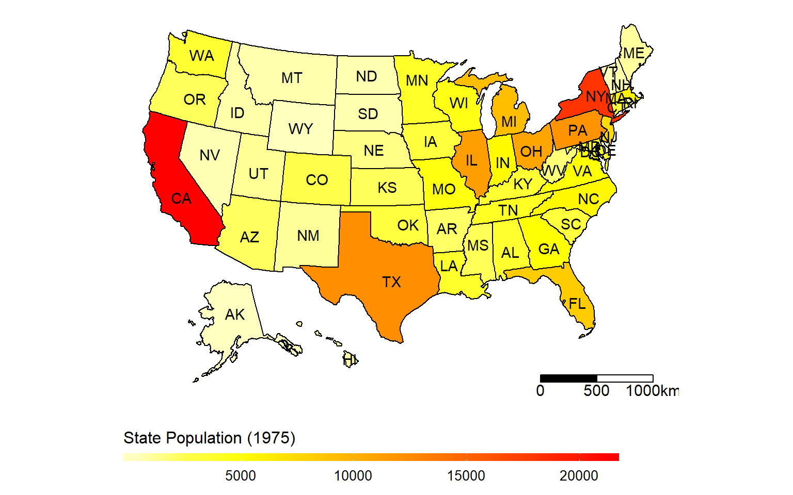
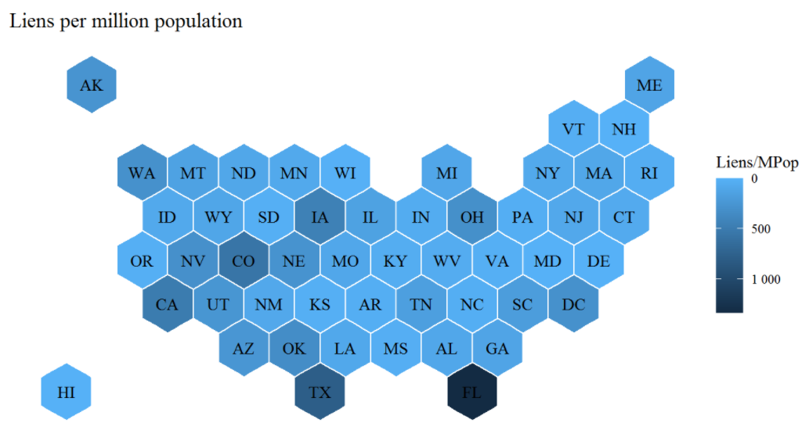

```{r setup, include=FALSE}
knitr::opts_chunk$set(echo = FALSE, warning = FALSE, message = FALSE)
library(tidyverse)
library(ggpubr)
```


## Making it All Make Sense

```{r, results = 'asis'}
cat("
<style>
.reveal section img {
  border: none !important;
  box-shadow: none;
}
</style>")
```

- Now that we've spent some time on technical detail and how to get things working...
- Let's bring it back to the point of all this, which is not to show off our R skills but to communicate effectively
- Don't be so proud of your ability to code something up that you forget to make the product good!

## Story and Data

- First off, remember our goals:
- Get across *an idea*
- Communicate *clearly*

## Story and Data

- It's surprisingly common for people to forget the goal of getting across an idea
- Granted, this isn't *always* necessary - some visualizations are just fun to look at even if we don't care what they say. But that's more like art than communication
- But in most settings we want to transmit an idea

## Story and Data

- What kind of ideas work well? 
- You can think of a story as something you *learn* from the data. It reveals something about the world.
- There's an important distinction between *showing the data* and *demonstrating an idea*
- Ask "what would I learn from viewing this visualization" and, crucially, "if I learned that thing, would I care?"

## Good Stories

Good stories:

- *Use data* to *broaden our understanding* of something, rather than using data to... show us data
- Provide an understanding that is interesting or actionable
- Don't prompt responses of "why should I care about this?"

## Visualization Implies the Story

- Your decision of what to include or exclude, and what to compare or contrast, *implies a story*
- Make sure it's the one you want to get across!
- Sometimes, you can just straight up say the idea in a title or annotation and just *demonstrate* with the visualization
- But a more satisfying (and convincing) result comes if the viewer comes to the conclusion on their own by viewing the viz
- Think "if I want people to come to this conclusion, what about my visualization points them there?"

## Visualization Implies the Story

- What conclusion would this (fictional) graph make us come to?

```{r, fig.height = 4.5}
set.seed(1000)
sal <- tibble(Person = c(rep('Aja',10), rep('Average\nEmployee',10)),
              Year = c(2010:2019,2010:2019)) %>%
  mutate(Salary = case_when(
    Person == 'Aja' ~ 30000 + 2000*(Year-2010) + rnorm(20, 0, 1000),
    Person != 'Aja' ~ 37000 + 500*(Year-2010) + rnorm(20, 0, 1000)
  ))

sal %>%
  filter(Person == 'Aja') %>%
  group_by(Person) %>%
  summarize(`Average Salary` = mean(Salary)) %>%
  ggplot(aes(x = Person, y = `Average Salary`)) + 
  geom_col(width = .3, fill = 'lightblue') + 
  geom_text(aes(label = scales::dollar(`Average Salary`)), vjust = -.5) +
  theme_pubr() +
  scale_y_continuous(labels = scales::dollar)+
  labs(title = 'Aja\'s Average Salary 2010-2019',
       x = NULL) 
```

## Visualization Implies the Story

- How about this?

```{r}
ggplot(sal %>% filter(Person == 'Aja'), aes(x = Year, y = Salary, color = Person)) + 
  geom_line(size = 1) + 
  geom_text(aes(x = Year + .1, y = Salary, label = Person),
            data = sal %>% filter(Year == max(Year), Person == 'Aja'),
            hjust = 0) +
  scale_y_continuous(labels = scales::dollar)+
  scale_x_continuous(limits = c(2010, 2020), labels = round) +
  theme_pubr() + 
  guides(color = 'none') +
  labs(title = 'Aja\'s Salary Over Time')
```

## Visualization Implies the Story

- And this one?

```{r}
ggplot(sal, aes(x = Year, y = Salary, color = Person)) + 
  geom_line(size = 1) + 
  geom_text(aes(x = Year + .1, y = Salary, label = Person, color = Person),
            data = sal %>% filter(Year == max(Year)),
            hjust = 0) +
  scale_y_continuous(labels = scales::dollar)+
  scale_x_continuous(limits = c(2010, 2020), labels = round) +
  theme_pubr() + 
  guides(color = 'none') +
  labs(title = 'Salaries Over Time')
```

## Visualization Implies the Story

- If our goal was to show that Aja's career has really taken off, which visualization works best?
- Is that a good story to try to tell?
- What might someone do with that information?

## Landing on the Story

- It's very easy for us to write a graph that *demonstrates the thing we already know* but doesn't *inspire that same idea in others*
- Like, if my daughter asks where grandma is, and I say grandma is at home, I want her to understand that grandma is currently at her own home in California. But my daughter might think she's at *our* home. I demonstrated, correctly, what the right answer was, but because it did not lead her to the right conclusion, it was bad communication on my part

## Tips

- Don't underestimate how difficult it is to get an idea across, especially indirectly by hoping someone sees *your intention* on a graph
- The best way to build intuition for how to do this is to *show other people your work and see if they come to the same conclusion you intended*
- Ask them what they think the graph means! Not just what it shows but what it *means*. The answer will often shock you

## Tips

- As we've discussed, *remove clutter*
- Think about the idea you're trying to get across and *remove everything that doesn't help make that idea clear*
- It's a common misconception that you must graph *all* the data, but let's say you want to show that your company's product is more expensive than the leading competitor. Which shows this more clearly - the prices of all 20 companies in the market, or just you vs. them? You can drop data! Or at least de-emphasize it.
- Separating things out is another good approach - facets are nice!

## Picking Geometries

- Moving along slightly but still in the same vein, the choice of *geometry* has a lot to do with what stories can be effectively communicated and how they come across
- There are also some common errors made with certain geometries
- So let's talk about them.
- We must ask: what does this geometry let us *compare* and *contrast*, and what do we *want* to compare and contrast?
- We can only evaluate a few but this will help us learn to evaluate them overall (and pick up some specific tips)

## In General

- If a geometry shows *lots of separate distinct objects* (like a bar graph), it wants you to compare those objects
- If a geometry draws *a continuous path* (like a line graph, or a cluster of points with a shape to it), it wants you to follow that path and see how it changes smoothly along some axis
- If a geometry shows *an area divided into many parts* (like a pie chart, treemap, or a stacked bar graph) it wants you to see how a whole object is divided up

## In General 

- If a geometry represents *something real* (like a map) then it expects us to interpret it as that real thing
- If a geometry shows *differing colors, sizes, or shades* (like a lot of stuff), it's expecting us to notice that something is *more* and compare it to something that is *less*
- If a geometry shows *crowded areas* and *sparse areas* (like a density plot, or clusters of points), it's expecting us to see which areas are well-populated and which aren't

## Bar Graphs

```{r}
ggplot(mtcars, aes(x = factor(cyl))) + 
  geom_bar() + 
  theme_classic() + 
  labs(x = 'Number of Cylinders',y = 'Number of Cars')
```

## Bar Graphs

Good for:

- Categorical x-axis variables
- For which you want to show a single count or summary statistic for each group
- Or possibly do a grouped bar chart (`position = 'dodge'`) to compare that summary statistic for that group within another grouping

(Tech tips: `geom_col()` lets you calculate bar height directly, `reorder()` in `aes()` lets you order the bars by size)

## Bar Graphs

Common mistakes:

- Overuse when other graphs (line graph, treemap) might be more appropriate
- Needing to compare values separated across long distances (next slide)
- Long labels on x-axis (try flipping the coordinates! `+coord_flip()`)
- Not using labeling to call attention to important parts
- Stacked bar charts outside a few good applications

## Bar Graph Mistakes Examples

- This requires us to do some visual gymnatics to compare the right stuff. A line graph would do this better.

```{r, fig.height=4}
data(storms)
storms %>%
  mutate(decade = floor(year/10)*10) %>%
  group_by(status, decade) %>%
  summarize(pressure = mean(wind, na.rm = TRUE)) %>%
  ggplot(aes(x = factor(decade), y = pressure, fill = status)) + 
  geom_col(position = 'dodge') + 
  theme_classic() + 
  labs(x = 'Decade',y= 'Mean Wind', fill = 'Hurricane Type')
```

## Bar Graph Mistakes Examples

- This requires us to do some visual gymnatics to compare the right stuff. A line graph would do this better.

```{r, fig.height=4}
data(storms)
sp <- storms %>%
  mutate(decade = floor(year/10)*10) %>%
  group_by(status, decade) %>%
  summarize(pressure = mean(wind, na.rm = TRUE))
ggplot(sp, aes(x = decade, y = pressure, color = status)) + 
  geom_line() + 
  geom_text(mapping = aes(x = decade + 1, y = pressure, label = status),
            data = sp %>% filter(decade == max(decade)),
            hjust = 0) +
  scale_x_continuous(limits = c(1970, 2020)) +
  guides(label = 'none',color = 'none') +
  theme_classic() + 
  labs(x = 'Decade',y= 'Mean Wind Speed', color = 'Hurricane Type')
```

## Bar Graph Mistakes Examples

```{r}
storms %>%
  mutate(decade = floor(year/10)*10) %>%
  group_by(status, decade) %>%
  summarize(N = n()) %>%
  ggplot(aes(x = factor(decade), y = N, fill = status)) + 
  geom_col() + 
  theme_classic() + 
  labs(x = 'Decade',y= 'Number of Storms', fill = 'Hurricane Type')
```

## Bar Chart Mistakes Examples

```{r}
storms %>%
  mutate(decade = floor(year/10)*10) %>%
  group_by(status, decade) %>%
  summarize(N = n()) %>%
  group_by(decade) %>%
  mutate(N = N/sum(N)) %>%
  ggplot(aes(x = factor(decade), y = N, fill = status)) + 
  geom_col() + 
  scale_y_continuous(labels = scales::percent) +
  theme_classic() + 
  labs(x = 'Decade',y= 'Proportion of Storms', fill = 'Hurricane Type')
```

## Stacked Bar Charts

- Stacked bar charts make comparisons difficult
- You can track the size of the bottom category but not the rest
- Requires you to track a whole lot of information
- ONLY good for if you are ONLY interested in bottom category AND the total, but NOT any other categories
- Also, please please only apply this to outcome variables where it makes sense to stack (sum them) together. "Average price by category" doesn't work.

## Stacked Bar Charts

- More broadly, a common mistake with stacked bar charts that I also see with pie charts, tree maps, and other geometries that divide an *area* up into *sections*:
- Dividing an area up into sections implies you are *dividing a whole into pieces* and also that you can *add the pieces back together to get the whole*
- This doesn't work with stuff like averages! If you stack "average male income" on top of "average female income" you don't get "average overall income". 

## Some Bar Graph Alternatives

```{r, fig.height=3, echo = TRUE}
# Good for taking up a bit less space, emphasizing the top
library(ggalt)
mtcars %>%  group_by(cyl) %>% summarize(N = n()) %>%
  ggplot(aes(x = factor(cyl), y = N)) + 
  geom_lollipop() + theme_classic() + 
  labs(x = 'Number of Cylinders',y = 'Number of Cars')
```

## Some Bar Graph Alternatives

```{r, fig.height=2, echo = TRUE}
# For just plain count-of-how-many, tree maps are way better at lots of categories
# Speaking of which, tree maps are better than pie charts almost 100% of the time
library(treemapify)
mtcars %>% group_by(cyl) %>% summarize(N = n()) %>%
  ggplot(aes(area = N, label = paste0(cyl,' Cylinders: ',N), fill = factor(cyl))) + 
  geom_treemap() + geom_treemap_text() + 
  guides(fill = 'none') + paletteer::scale_fill_paletteer_d('colorblindr::OkabeIto')
```


## Line Graphs

- Line graphs are good for one-to-one relationships between the x and y axis
- One x in, one y out $\rightarrow$ a bunch of x in, one line out
- Almost always x is in consistent discrete jumps (i.e. 1 2 3 not 1 3 100)
- Often, x is time
- Change over time
- When change occurred
- How different groups change (multiple line graphs on the same axes)

## Common Mistakes with Line Graphs

- Too many lines
- Lines that cross back and forth with each other and obscure each other a lot
- Legends (label the lines! It's easy! `geom_text()`)
- Huge range in the y-axis (or too little range)
- Multiple y-axes
- An unordered x-axis (don't use a line graph for bar graph jobs!) - remember, the line implies continuity!
- Curved lines can give illusion of continuity if it's not there

## A Line Graph

```{r}
data(storms)
sp <- storms %>%
  mutate(decade = floor(year/10)*10) %>%
  group_by(status, decade) %>%
  summarize(pressure = mean(wind, na.rm = TRUE))
ggplot(sp, aes(x = decade, y = pressure, color = status)) + 
  geom_line() + 
  geom_text(mapping = aes(x = decade + 1, y = pressure, label = status),
            data = sp %>% filter(decade == max(decade)),
            hjust = 0) +
  scale_x_continuous(limits = c(1970, 2020)) +
  guides(label = 'none',color = 'none') +
  theme_classic() + 
  labs(x = 'Decade',y= 'Mean Wind Speed', color = 'Hurricane Type')
```

## Scatterplots

- Scatterplots show the relationship between two **continuous** variables, plotting every observation
- Use when that's your goal, explaining how two variables move together AND you can see that relationship on the graph
- The shape of the relationship between them (positive, negative, null, U-shaped, etc.) should be clear
- Can also be handy for pointing out outliers (with annotation)
- Adding best-fit lines: when? If you want to refer to its slope, or if the shape is still *clear* but could maybe use a little help, or to contrast a couple of groups

## Scatterplots

```{r}
mtcars %>%
  mutate(Transmission = case_when(
    am == 0 ~ 'Automatic',
    am == 1 ~ 'Manual'
  )) %>%
ggplot(aes(x = mpg, y = hp, color =Transmission)) + 
  geom_point() + 
  theme_classic() + 
  labs(x = 'Miles per Gallon',y = 'Horsepower')
```

## Common Scatterplot Mistakes

- Expecting too much of the audience (scatterplots are easy to *understand* but it usually takes experience to *walk away with the story* from a scatterplot)
- Doing it with too many points - likely either a confusing mess, or at least some data will be obscured
- Non-continuous X or Y variables! `geom_jitter()` only helps a bit

## Too many points! 

```{r}
data(Scorecard, package = 'pmdplyr')
ggplot(Scorecard, aes(x = earnings_med, y = repay_rate)) + 
  geom_point() + 
  theme_classic() + 
  scale_x_continuous(limits = c(0, 100000)) +
  labs(x = 'Miles per Gallon',y = 'Horsepower')
```


## Alternative for too many points

- Density coloring with `geom_bin2d`, although this requires some sophistication to read

```{r, fig.height=4}
data(Scorecard, package = 'pmdplyr')
ggplot(Scorecard, aes(x = earnings_med, y = repay_rate)) + 
  geom_bin_2d() + 
  theme_classic() + 
  scale_x_continuous(limits = c(0, 100000)) +
  labs(x = 'Median Graduate Earnings',y = 'Loan Repayment Rate',
       title = 'Loan and Earnings Success of College Graduates')
```

## Alternatives for Factors

- Factor vs. continuous: ridge or violin density plots (next section)
- Factor vs. factor: heatmaps as above, [balloon plots](https://rpkgs.datanovia.com/ggpubr/reference/ggballoonplot.html)


## Tables

- When individual values are *important*
- We want things to be easy to look up
- and CONCISE. Tables are inherently too messy so trim out everything

## Bad Table

```{r}
data(UN, package = 'carData')
knitr::kable(UN, row.names = TRUE)
```

## Table Fixes

- Tables for a non-specialist audience should only have a few variables. Usually 1-2 "identifying" rows (state, year, rank, etc.) and 1-2 "data" rows
- Make sure the numbers look nice, no eight digits after the decimal; add things like % signs and $ signs.
- In R you can often do this with the **scales** package

## Easy to Read

- Short:  Nobody likes to scroll through an enormous table
- Consider not showing ALL the data here, maybe just a "top ten" if that's relevant
- If all the data really is necessary, try to make its presentation shorter and encourage scrolling while everything else stays in place
- Consider "striping" to make different rows easy to distinguish with `kableExtra::kable_styling(bootstrap_options = 'striped')
- More coloring and customization with `ggtexttable` in **ggpubr** (note this makes the table as an image)

## Easy to Read

```{r, results = 'asis'}
UN %>%
  mutate(Country = row.names(.),.before='region') %>%
  select(Country, ppgdp, pctUrban) %>%
  arrange(-pctUrban,-ppgdp) %>%
  slice(1:5) %>%
  mutate(ppgdp = scales::dollar(ppgdp),
         pctUrban = scales::percent(pctUrban/100,accuracy = 1)) %>%
  rename(`Per-Capita GDP` = ppgdp, `Percent Urban` = pctUrban) %>%
  knitr::kable(caption = 'Top Five Opportunities for Expansion', format = 'html') %>%
  kableExtra::kable_styling(bootstrap_options = c('striped','hover'))
```

- This could be even better - generally you want as few borders as possible (but RMarkdown is not cooperating)


## Hall of Shame

- Pie charts: not *the worst* but rarely better than a bar chart or treemap. We just don't distinguish angles that well. Works best with ONLY one category you care about, and with percentages labeled. At least people understand them
- Word clouds: I have no idea what anyone would learn from one of these. Looks pretty?
- [Bubble charts](https://help.tableau.com/current/pro/desktop/en-us/buildexamples_bubbles.htm). Carries little info in a lot of space, and in very hard-to-see ways (compare circle areas?). Tableau recommends them for some reason.

## Let's evaluate

How about density plots?

- `geom_density()` and `geom_histogram`, `geom_dotplot`, extras like `geom_violin` and the **ggridges** package
- What would these work well for and what would they not?
- What problems might we run into?

## Let's evaluate

- How about heatmaps on actual maps? Same question



## Let's evaluate

- And what would a version like this solve for us?



## Gallery

- There are LOTS of other options out there. For example, [paired plots](ggpubr::ggpaired https://rpkgs.datanovia.com/ggpubr/reference/ggpaired.html), Sankey diagrams, path diagrams, etc. etc.
- We can see the [gallery](https://exts.ggplot2.tidyverse.org/gallery/) but our key here is being able to evaluate whether a geometry works for what *we want to get across* and can do it in a clear way

## Practice

- Download this file of robocall complaints to the FCC: [https://www.kaggle.com/fcc/robocall-complaints](https://www.kaggle.com/fcc/robocall-complaints)
- Think of a basic story (it's ok if it's not stellar)
- Think about the best geometry to tell that story
- Sketch a graph to tell that story as clearly as possible
- If you have time, make it
- You can load it with `read_csv()` and, if necessary, use `ymd` in **lubridate** to make the date a date


HEY HEY HEY

## Downloadable Geometries

- There are so, so many **ggplot2** geometries available
- Way too many to cover - see the [ggplot2 extension gallery](https://exts.ggplot2.tidyverse.org/gallery/) in addition to the base-**ggplot2** cheat sheet from last time
- I will go over some popular ones. Google package names for more detailed explanations
- We won't go deeply into how to use these, this is more to show you they exist and an example so you can look further yourself if you're interested

## geom_text to geom_repel

- We covered geom_text last time
- But the text gets in the way! How did I handle this in that `mtcars` graph I just did?

```{r, echo = FALSE, fig.height = 4, fig.width = 6}
data(mtcars)
mtcars <- mtcars %>%
  mutate(Transmission = factor(am, labels = c('Automatic','Manual')),
         CarName = row.names(mtcars))
ggplot(mtcars, aes(x = mpg, y = hp, color = Transmission, label = CarName)) + 
  geom_text()
```

## geom_text_repel

```{r, echo = TRUE, fig.height = 3.75, fig.width = 6}
library(ggrepel); data(mtcars)
mtcars <- mtcars %>%
  mutate(Transmission = factor(am, labels = c('Automatic','Manual')),
         CarName = row.names(mtcars))
ggplot(mtcars, aes(x = mpg, y = hp, color = Transmission, label = CarName)) + 
  geom_text_repel() + labs(x = 'MPG',y='HP')
```

## geom_label_repel adds boxes

- That was still pretty busy. Text graphs really only work with a smaller number of labels (or short ones)

```{r, echo = TRUE, fig.height = 4, fig.width = 6}
ggplot(mtcars[1:10,], aes(x = mpg, y = hp, color = Transmission, label = CarName)) + 
  geom_label_repel() + labs(x = 'MPG',y='HP', caption = 'First ten cars only')
```


## ggridges


```{r, echo = TRUE, fig.height = 4, fig.width = 6}
#A common need is to graph distributions across groups
library(ggridges)
ggplot(mtcars, aes(x = mpg, y = factor(cyl), fill = factor(cyl))) + 
  geom_density_ridges(alpha = .6) + 
  labs(x = 'Miles per Gallon', y = 'Cylinders') + 
  guides(fill = FALSE)
```


## ggmap

- **ggplot2** has *extensive* mapping capabilities
- Including straightforward-ish map *animations* with the **tmap** package
- Also see libraries **choloropleth**, **tigris**, **tmap**, **sf**, **fiftystater**


## ggforce

- **ggforce** is a package with LOTS of extras, especially for facets
- An especially handy one is `facet_zoom` for showing all data but focusing in on some
- Focus focus focus your audience!
- Can also be used to focus on a range with `xlim` or `ylim`


## ggalt

- **ggalt** is another package with lots of additional geoms
- Including some functions to automatically encircle your data (setting things apart!)
- Two nice ones are `geom_lollipop` for lollipop charts (a nice-looking alternative to a bar chart)
- and `geom_dumbbell` for dumbbell charts (nice for "to-and-from" changes within groups)

## geom_lollipop

```{r, echo = TRUE, eval = FALSE}
library(ggalt); data(gss_cat, package='forcats')
gss_cat <- gss_cat %>%
  group_by(marital) %>%
  summarize(PropAbove = mean(rincome == '$25000 or more')) 
ggplot(gss_cat, aes(y=PropAbove, x = reorder(marital,PropAbove))) + 
  geom_lollipop() + labs(x = 'Marital Status', y ='Proportion Earning $25k+')
```

## geom_lollipop

```{r, echo = FALSE, eval = TRUE, fig.height = 4, fig.width = 6}
library(ggalt); data(gss_cat, package='forcats')
gss_cat <- gss_cat %>%
  group_by(marital) %>%
  summarize(PropAbove = mean(rincome == '$25000 or more')) 
ggplot(gss_cat, aes(y=PropAbove, x = reorder(marital,PropAbove))) + 
  geom_lollipop() + labs(x = 'Marital Status', y ='Proportion Earning $25k+')
```

## geom_dumbbell

```{r, echo = TRUE, fig.height = 4, fig.width = 6}
top_bottom <- mtcars %>% group_by(cyl) %>%
  summarize(worst = max(mpg), best = min(mpg))
ggplot(top_bottom, aes(y = cyl, x = best, xend = worst)) + 
  geom_dumbbell(size = 3, color = 'gray',colour_x = 'blue', colour_xend = 'red')

```

## gganimate

- The **gganimate** package makes it fairly straightforward to animate your graphs
- Take a graph and use a `transition_` command to have it assign one axis to *time*
- Make sure this actually adds something! This limits where the graph can be shown

## gganimate

```{r, echo = TRUE, eval = FALSE}
library(gganimate)
data(gapminder)
options(gganimate.dev_args = list(width = 650, height = 400))
p <- ggplot(gapminder,
       aes(x = gdpPercap, y = lifeExp, color = continent)) + 
  geom_point() + 
  scale_x_log10() + 
  labs(x = "GDP per Capita (log scale)", y = "Life Expectancy",
       title = "GDP and Life Expectancy by Country, 1952-2007",
       color = 'Continent') + 
  transition_time(year))
animate(p,nframes = 200,end_pause = 30)
```

## gganimate

```{r}
library(gganimate); data(gapminder, package='gapminder')
options(gganimate.dev_args = list(width = 650, height = 400))
p <- ggplot(gapminder,
       aes(x = gdpPercap, y = lifeExp, color = continent)) + 
  geom_point() + 
  scale_x_log10() + 
  labs(x = "GDP per Capita (log scale)", y = "Life Expectancy",
       title = "GDP and Life Expectancy by Country, 1952-2007",
       color = 'Continent') + 
  transition_time(year)
animate(p,nframes = 200,end_pause = 30)
```
