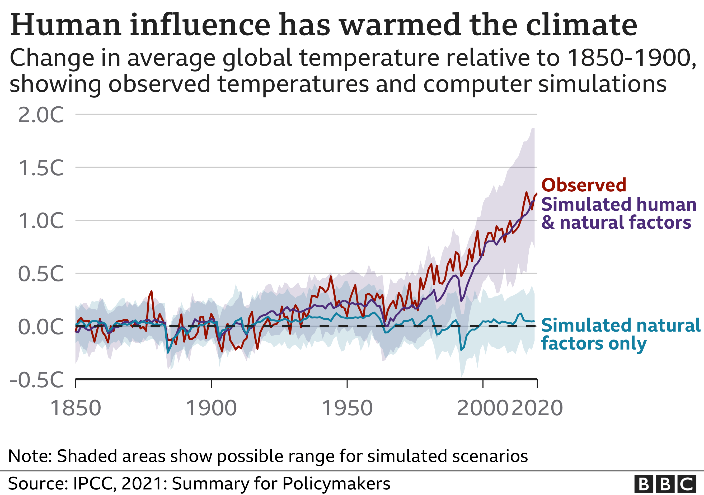

```{r setup, include=FALSE}
knitr::opts_chunk$set(echo = FALSE, warning = FALSE, message = FALSE)
library(tidyverse)
library(ggpubr)
```


## Data Communications

```{r, results = 'asis'}
cat("
<style>
.reveal section img {
  border: none !important;
  box-shadow: none;
}
</style>")
```

- When you are doing data communications, what you are generally doing is *taking data*, using that data to draw some sort of *conclusion*, and then demonstrating that conclusion with the data in a convincing and accessible way
- Statistics, roughly, is the process of drawing conclusions from data
- If you can't do that right, then at best you'll be great at communicating bad or useless information

## Data Communications

- I'm not going to attempt to squash an entire statistics education in today
- I'm going to assume that your technical stats education is to some degree limited, acknowledge that you will keep building on it and encourage you to do as much as you can (imagine a data analyst uninterested in getting as good at statistics as possible! Would you trust their work?)
- I'll focus on how to get as much as right possible from a *conceptual* working-with-data standpoint
- Many, many, *many* bad errors are ones that require no advanced mathematical skill to figure out or correct

## Drawing Conclusions from Data

Things to Get Right:

- Properly using and understanding the data
- Properly understanding what the data tells us (and doesn't tell us) about the real world
- Creating plausible results
- Doing the right calculations
- Properly accounting for uncertainty

(many statistics classes only bother with the last two!)

## Properly Using and Understanding the Data

- *Read the data documentation*. Don't just rely on column names! These give you an indication of what the variable is, but not all the details of what it means, what question was asked to get it, and so on.
- This includes both documentation about the variables themselves *and* information about how the data was collected - who's in the sample, how they were interviewed
- Be critical! Was there a likely agenda behind data collection or how things were measured? How big is the sample?

## Properly Using and Understanding the Data

- Measurement is important! If we don't think the measurement is good and means what we think it means, there's little point in doing data analysis anyway
- Measurement can be bad because it's *noisy* (the data isn't very precise or there are errors in it), because it's *misleading* (the questions is fine but you're trying to use the data in a wrong way), because it's *weak* (small sample, big data categories) or because it's *insufficient* (you're trying to answer a much grander question than the data can really handle)
- Also, be aware of missing data! If  a variable is missing for a lot of people it may not be usable without some truly fancy advanced stuff that you don't want to do without really understanding it

## Be Careful!

- Nothing worse than finding out *after* the fact that you were reading your data wrong
- Author [Naomi Wolf](https://boingboing.net/2019/05/24/listen-to-an-author-realize-he.html) had a book about the treatment of homosexuality in 19th century England. She reported that it was punishable by death since "sodomy" charges were followed by "death recorded" in the judicial logs
- However, "sodomy" referred to a host of other sexual offenses, and "death recorded" specifically means they *weren't* killed because their death was *recorded* but not carried out
- The main point of the book fell apart! Because she didn't understand the measurements

## Be Careful!

- [Paul Dolan](https://www.vox.com/future-perfect/2019/6/4/18650969/married-women-miserable-fake-paul-dolan-happiness) wrote a book about how marriage makes you miserable
- A key part of this was the finding that, in the American Time Use Survey, married people surveyed about their happiness when the spouse was present reported being happy, but when the spouse was absent they reported being unhappy. Covering up unhappiness in front of their spouse, truly miserable!
- But while Dolan read spouse present/absent as "spouse is in the room during questioning", it actually meant "spouse together/separated." He was comparing couples that were together vs. couples that were separating!
- Didn't read the data documentation. Oops.

## Be Careful!

- A bunch of prominent psychologists wrote a landmark study about how asking people to sign a "I agree to be truthful" statement at the *beginning* of a form made them more honest than signing at the *end* of the form
- Nine years later, another researcher actually [looks at their data](https://science.thewire.in/the-sciences/evidence-of-fraud-in-an-influential-field-experiment-about-dishonesty/) and finds extremely clear evidence that the data was entirely faked (likely by the insurance company the researchers partnered with, not the researchers themselves)
- If they'd just checked to see whether the data was plausible, they'd never have published the paper
- Instead, years later one of their biggest studies turns out fake and throws other work into suspicion by a general audience!


## What does the Data Tell Us?

- Ok, so we have the data and understand what it is and whether it is of high quality, and we perform our analysis. Good, right? Maybe!
- We have to carefully consider what the data does tell us and what it doesn't tell us.
- *Identification* is the econometrics concept that asks "does the *statistical calculation we just ran* answer the *theoretical question we have*?"

## Theory and Hypothesis

- If you want to learn anything from your data analysis, you have to come in with a theory
- "Theory" just means there's a "why" or "because" in there - "sales went up *because* there was a promotion in place"
- Very rarely can we actually see a "why" or "because" in data. Instead we get a calculation like "average sales were higher in periods where a promotion in place than in periods where there wasn't"
- The *calculation* is rarely interesting (we really want to know if those sales are effective, not whether sales *happened* to be higher!). Identification asks "can we learn anything about the theory from the calculation?"

## Theory and Hypothesis

- The formal process of statistical identification can be very tough (although check out [my book chapter 5](https://theeffectbook.net/ch-Identification.html)!), but there are some easy first stabs you can take at it. Ask:
- If your theory is true, *what pattern should you see in the data* and *what pattern should you NOT see in the data*? These are hypotheses. Try to test more than one if possible.
- *Why* might we see this pattern in the data? Is my theory the only reason we would see this pattern? Is it the *most likely* reason we'd see this pattern? If not, we aren't identified.
- If you saw a *different* pattern in the data, would it make you *disbelieve* your theory? If not, you probably shouldn't put much stock in the fact that you *do* see that pattern

## Example

- Let's take the example of a toy company who wants to know if their ads work. They have data on how much money they spent on ads each month, and also how many sales they had each month.
- What patterns should we see and not see in the data?
- Keep in mind that, given the available data (or the allowable sophistication of methods) you may not be able to get a pure and clean identification. But get as close as you can, and be aware of remaining gaps

## Example

An obvious answer:

- Sales should be higher in months with more ads

There are other answers (which may lead to better identification) but let's go with this and see where it takes us

## Example

Why might we see this pattern in the data (that sales are higher in months with more ads)

- Ads might cause sales to rise
- Perhaps the company chooses to advertise more in months it expects to get more sales anyway

Uh-oh. Maybe we see that "ads are effective" just because December is a boom month for both ads and sales?

## Example

If we saw a *different* pattern, would that put us off our theory?

- If we saw no relationship (or a negative one) between sales and ads, we might try to wriggle out of it by saying that maybe they advertise more in anticipated *bad* months to shore up sales
- Hmm... but if that's our explanation, then if we *did* find a positive relationship, maybe the real explanation is just that they advertise more in expected banner months. Which is it?

(note we might be able to test this alternate explanation in the data by, say, predicting sales with previous years' sales that month)

## Example

So what now?

- We'd want our analysis to be sure we can account for this possible "anticipated sales" problem. Otherwise we're leaving something out and just showing that sales are higher in high-ad months doesn't tell us if ads are effective
- (this isn't a toy problem, by the way - marketing departments have a heck of a time proving whether ads have any effect at all for this very reason)
- Maybe doing some sort of experiment where ads aren't set by anticipation for a while, or having some way of adjusting for anticipation. These are the alternate calculations that we think might *identify* our theory

## In General

- For this reason it's a good idea to avoid "causal language" unless you have a good idea that you are identified
- Business schools tend to skip this warning in my experience, leading to common problems like "do ads actually work?"
- Yes, you found that sales are higher with ads. Does that mean you should advertise more? There's an identification gap between the first and second thing.

## More Accurate Communication

- You can be more accurate by saying what you actually found - "sales were higher when there were more ads" - instead of "ads improved sales" (causal language which implies a direction for the relationship). Then you can discuss what that actually means in terms of decision-making (*should* we increase ads? What *can* the data tell us about that question? What else would we want to know first?)

## Creating Plausible Results

- A great indication that something is wrong about your data or analysis, or that you're not identified, is simply in whether your results *make any darn sense*
- Data is wrong sometimes, and errors can become clear only in retrospect! So a good gut-checking instinct is really key, especially in areas like business where you know you'll get things a *little* wrong and have imperfect data, but need to know if it's *too wrong to be useful*

## Creating Plausible Results

Always be asking yourself:

- "If I did this right, what should I see?"
- "Does this look like it's supposed to look?"
- "Do I believe this result? If not, is it implausible or *impossible*?"

## Creating Plausible Results

- Sometimes there are genuine surprises in data, and you don't want to toss those out, so you'll be walking the fine line between "this is strange" and "this must be wrong, I made an error, go back"
- This all applies to *both* data and analysis. Any time you do something with data, *look at the result* and make sure it doesn't seem wrong. What should be there but isn't? What shouldn't be there but is?

## Creating Plausible Results

- Explore the data! See what looks way wrong - implausible averages, outliers that are so far gone they're probably errors, "missing data" coded as values like -99, etc.
- After each data cleaning step, *look at the data to make sure it actually did what you thought*. I can't stress this enough. Please do this!
- In each analysis, *ask yourself what the result is saying and if it's at all plausible*
- For example, if you find that your sales are only nonzero in two weeks of the year, that's probably wrong. Or that the ad sales are 5x the non-ad sales, that's probably wrong too!

## Doing the Right Calculations

- Now we come to actually performing statistical calculations. 
- Again, I won't try to squeeze all of statistics into this one section of one lecture
- But some general guiding principles to think about:

## Doing the Right Calculations

- Statistical calculations aren't universal - they are intended for particular contexts and make certain assumptions
- These assumptions can be things like "what is the distribution of the data?" or "what kind of comparison are you trying to make?"
- This means that just tossing some data into a calculation you've heard of is *very likely to lead to results that don't mean what you think they mean*
- For example, in one of my classes, a huge number of students tried to use a two-sample t-test to check for a correlation between two continuous variables. This does not work.

## Tips for Wading into Statistical Waters

- *Don't use tests or models you don't understand*. Recognize that the cost of using a fancier model, or just something you're unfamiliar with (on top of haivng to figure out how to explain your results) is going to be the the work of reading all about both the method and the software that goes with it
- If you can't or won't do that, don't use the method. A simpler, imperfect method you do understand is better than a more complex one you don't (as long as you understand the ways it's imperfect)

## Tips for Wading into Statistical Waters

- Even if you think you understand the method, read up on the code used to perform it. It may not work in the way you expect it to
- Remember, if you don't understand it, then you don't know how it's supposed to work, and you have no way of gut-checking it to see if it's going wrong

## Statistical Significance

- One important aside here, as long as we're talking about using methods we don't understand, is *statistical significance*. Significance is wildly misused
- What is statistical significance?
- Significance takes a *theoretical statement about how the data is distributed*
- It then looks at the actual data and asks "what's the chance we'd see data like this if that theoretical statement is true?"
- If the probability (p-value) is very low, we say that the theoretical proposition is unlikely and so reject it

## Statistical Significance

Notice what's not in there:

- How important the effect is
- Whether the estimate we *do* get is right / what the actual effect is
- Whether the estimate we do get is more right than some *other* estimate that also doesn't match the theoretical distribution
- Whether there's an X% chance of the effect being real or we are "X% confident" of an effect
- Being insignificant doesn't mean there's *no* effect, it just means there's not enough evidence to *reject* a null effect


## Statistical Significance

- Usually the theoretical statement is of the form "the relationship / mean is zero" (which, isn't that often obviously untrue?) 
- *All* statistical significance says is that the null hypothesis is unlikely
- *Assuming you've even set up the test properly* - hypothesis tests are based on assumptions too and will be wrong if that's not satisfied, and in any case are you identified?
- And do you have the *statistical power* (big enough sample) to make a failure-to-reject meaningful? Or do you perhaps have a sample so huge that basically everything is significant but it doesn't mean much?

## Statistical Significance

- People like to hear about statistical significance, and it's not a useless concept, but you have to be careful in what you can make from it
- Insignificant *doesn't mean wrong*, it just means insignificant. And it's definitely not a *goal*. **Never** change your analysis to chase significance
- Like with other statistical calculations, be aware of what you're *doing*, what the *assumptions are*, and what *the actual data says* rather than what you're hoping it says. And **don't use it if you don't understand it**

## Communicating Uncertainty

- That said, statistics and data is still all about uncertainty. You want to get that across to have an honest form of data communication
- Estimates are uncertain! Sampling variation will getcha. So will uncertainty in what's left out of the analysis
- Non-stats people often don't want to hear about it, but it's important. How can we communicate this?

## Communicating Uncertainty

- Ways of communicating uncertainty that people tend to be able to understand are *distribution percentiles* and *confidence bands*
- Distribution percentiles are things of the form "X% of the time, this variable will be below Y"
- So for example "average sales are 1000 dollars per month, but 10% of the time they're below 500 dollars"
- In actual data, that calculation can come from just the proportion of observations below/above a certain value
- In an estimated value, you can use the sampling distribution (like, calculating a mean and standard deviation and using the normal distribution) to calculate percentiles

## Communicating Uncertainty

- Confidence bands are related to statistical significance but come at it in a different way that maybe communicates the uncertainty more accurately (and in more detail than just an up/down significant/insignificant)
- Basically, you want to describe the distribution of the estimate from a low percentile to a high one so as to get across how much it might vary from sample to sample
- Plus, these are easy to graph
- And work with forecasts too (although technically these are "forecast intervals")

## Communicating Uncertainty

- So perhaps you find that, on average, sales with an ad in place are $120 higher than sales without an ad in place
- Using the distribution might say "on average, sales are $120 higher with an ad in place, but it varies, with about 10% of sales only being $15 higher than normal"
- The confidence band might be "we'd expect that 95% of sales wit ads in place will be between $5 and $225 higher than normal sales"

## Forecast Bands - easy to interpret right?

