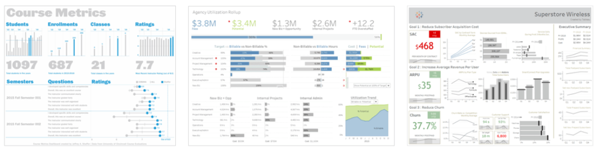

```{r setup, include=FALSE}
knitr::opts_chunk$set(echo = FALSE, warning = FALSE, message = FALSE)
library(tidyverse)
library(paletteer)
options("kableExtra.html.bsTable" = T)
rinlinevarname <- function(code){
  html <- '<code  class="r">``` `CODE` ```</code>'
  sub("CODE", code, html)
}
```


## Dashboards

```{r, results = 'asis'}
cat("
<style>
.reveal section img {
  border: none !important;
  box-shadow: none;
}
</style>")
```

- Everything we've done so far has focused on *single images*
- But there's only so much you can fit on one image! (although it's still a lot if done right)
- The hot new thing is *dashboards*
- Dashboards are *many* visualizations and tables on a single page to let you really explore the data
- Often, interactive - hover-over for more information, or use menus to change which of the underlying data you're looking at

## Tips for Dashboards

- (Inspired by [this article](https://www.tableau.com/about/blog/2017/10/7-tips-and-tricks-dashboard-experts-76821).)
- Avoid clutter both in presentation *and* interactivity
- Use a grid
- Use consistent and clear colors and fonts
- No scrolling! Dashboards aren't articles (those are neat too though)
- Draw focus within visualizations as always (use differences *between* visualizations as well)
- Also draw focus *between* visualizations with location and size

## Avoid Clutter

- We know this one!
- In the context of dashboards, it also means not presenting *all* the results you can
- Think about what's redundant, what's unnecessary, what's distracting, and what's likely to be misinterpreted
- Get rid of 'em!
- Also avoid big walls of color

## Avoid Clutter

```{r}

```


## Fonts and Colors

- Big and bold for up-top conclusions
- Smaller, generally serif fonts for other graphs
- Avoid using LOTS of fonts
- You can help the reader see the structure by having one font for BIG, another for medium, another for small

## Fonts and Colors

- When it comes to color, one or two is often enough! 
- Instead of lots of color designating groups, standard here is to break groups into single-group graphs (facets)


```{r}

```

## Focus

- As always, figure out the story and focus on that
- Buzzword here is KPI: "Key point of interest". Make it big, make it stand out!
- Notice how readable ALL of these have been at tiny sizes!

```{r}

```


## Examples

- Let's explore each of these examples and see what works and what might not
- [Year-to-Date Income Statement](https://public.tableau.com/views/IncomeStatement_4/IncomeStatement?:embed=y&:display_count=yes&publish=yes&:showVizHome=no)
- [NBA Scoring Dashboard](https://rpubs.com/jcheng/nba1)
- [Economic Indicators for the USA](https://research.stlouisfed.org/dashboard/1151)

## Dashboards in R

- R dashboard provide you access to a huge range of free premade graphical tools through htmlwidgets
- See the [htmlwidgets gallery](https://www.htmlwidgets.org/showcase_leaflet.html)
- Good for everything, but the maps do really stand out
- As you learn these tools you can include them not just in dashboards but in RMarkdown docs, too
- And also, it's not just htmlwidgets, but also Shiny!

## Shiny

- Shiny is more internal to R than htmlwidgets; it's an R-specific interactive site builder
- You can add user controls to allow them to change parameters around and see the results
- Great for dashboards, but even beyond that, learning Shiny for the purpose of dashboards will also give you the tools to create data-based *apps* that you can upload on their own
- Super cool stuff you can do if you branch out with this!

## On to dashboards

- There are two approaches to doing dashboards in R. One is Shiny-focused, and the other is htmlwidgets focused (but lets you include Shiny stuff)
- We'll be going with the latter, as it's easier, but the Shiny one is good too.
- Our approach will be to use **flexdashboard**
- Install **flexdashboard** with `install.packages('flexdashboard')`
- Then you can open a new Flex Dashboard by going File $\rightarrow$ New File $\rightarrow$ R Markdown $\rightarrow$ From Template $\rightarrow$ Flex Dashboard.
- Plenty of info on [https://rmarkdown.rstudio.com/flexdashboard/](https://rmarkdown.rstudio.com/flexdashboard/)

## What Do We See?

```{r}

```

## What Do We See?

- Up top is the YAML - we know this from working with RMarkdown docs. Basic info about the doc itself
- Then we have our *layout structure* - columns of stuff, with multiple graphs per columns
- We can if we prefer lay things out row-wise (see next slide), and "storyboard" where it goes from page to page like a flipbook
- Then within each column we have our graphs, labeled with three hashes

## Row orientation

```{r}

```

## Content

- We can of course fill those charts with regular-ol **ggplot2** output
- (or **gganimate**, or whatever else produces an image file)
- Or Shiny stuff, which we'll get to next time
- But also there are a bunch of packages designed to output **htmlwidgets** that we can include! Many of them look real nice
- Let's peruse: [The HTMLWidgets R Gallery](http://gallery.htmlwidgets.org/)
- We'll go more into detail on these next time


## Material

- When it comes to any complex programmatic system like this, you always want to look at the docs at least a little
- Let's just spend some time walking through [https://rmarkdown.rstudio.com/flexdashboard/](https://rmarkdown.rstudio.com/flexdashboard/) if only to see what's possible and what we need to know
- Then come back here

## Practice

- Open a Flex Dashboard template
- Load any data set (in the Dashboard code)
- Make a Flex Dashboard and set its `theme`
- Include three graphs: one regular **ggplot2**, that same graph again but with a different theme, and one graph from [http://gallery.htmlwidgets.org/](http://gallery.htmlwidgets.org/) - an easy pick is [dygraphs](https://rstudio.github.io/dygraphs/) line graphs (although you do have to format your data as `xts`... try the **tbl2xts** package and its `tbl_xts()` function)
- If you can make it look nice that's great! But focus more on getting it to work.