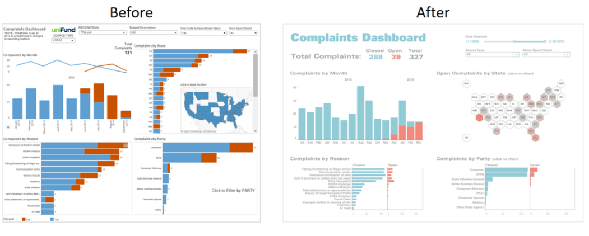
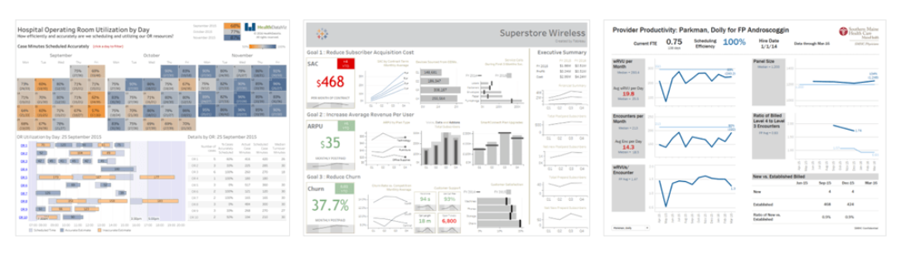
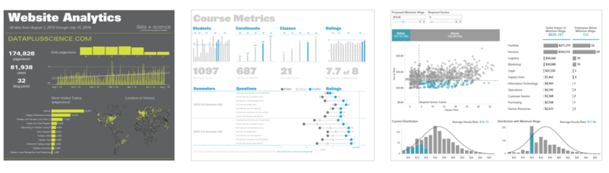
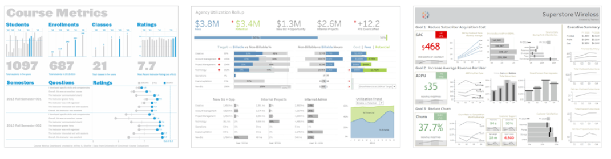

```{r setup, include=FALSE}
knitr::opts_chunk$set(echo = FALSE, warning = FALSE, message = FALSE)
library(tidyverse)
options("kableExtra.html.bsTable" = T)
rinlinevarname <- function(code){
  html <- '<code  class="r">``` `CODE` ```</code>'
  sub("CODE", code, html)
}
```


## Dashboards

```{r, results = 'asis'}
cat("
<style>
.reveal section img {
  border: none !important;
  box-shadow: none;
}
</style>")
```

- Everything we've done so far has focused on *single images*
- But there's only so much you can fit on one image! (although it's still a lot if done right)
- The hot new thing is *dashboards*
- Dashboards are *many* visualizations and tables on a single page to let you really explore the data
- Often, interactive - hover-over for more information, or use menus to change which of the underlying data you're looking at

## Dashboards

- We'll go over how to create dashboards in both Tableau and R
- But for today we're going to look more generally at how dashboards work and what makes a good one
- Hopefully this will give us some ideas we can implement when we learn the technical side!

## Tips for Dashboards

- (Inspired by [this article](https://www.tableau.com/about/blog/2017/10/7-tips-and-tricks-dashboard-experts-76821).)
- Avoid clutter both in presentation *and* interactivity
- Use a grid
- Use consistent and clear fonts
- Use consistent colors
- Draw focus within visualizations as always
- Also draw focus *between* visualizations with location and size

## Avoid Clutter

- We know this one!
- In the context of dashboards, it also means not presenting *all* the results you can
- Think about what's redundant, what's unnecessary, what's distracting, and what's likely to be misinterpreted
- Get rid of 'em!
- Also avoid big walls of color

## Avoid Clutter

```{r}

```

## Use a Grid

- Everything overlapping can be hard to read
- If you set up your grid very well, a story can be told through the columns or through the rows

```{r}

```

## Fonts and Colors

- Big and bold for up-top conclusions
- Smaller, generally serif fonts for other graphs
- Avoid using LOTS of fonts
- You can help the reader see the structure by having one font for BIG, another for medium, another for small

## Fonts and Colors

- When it comes to color, one or two is often enough! 
- Instead of lots of color designating groups, standard here is to break groups into single-group graphs (facets)


```{r}

```

## Focus

- As always, figure out the story and focus on that
- Buzzword here is KPI: "Key point of interest". Make it big, make it stand out!
- Notice how readable ALL of these have been at tiny sizes!

```{r}

```


## Examples

- Let's explore each of these examples and see what works and what might not
- [Year-to-Date Income Statement](https://public.tableau.com/views/IncomeStatement_4/IncomeStatement?:embed=y&:display_count=yes&publish=yes&:showVizHome=no)
- [SafeGraph Reopening the Economy](https://www.safegraph.com/dashboard/reopening-the-economy-foot-traffic)
- [NBA Scoring Dashboard](https://beta.rstudioconnect.com/jjallaire/htmlwidgets-d3heatmap/htmlwidgets-d3heatmap.html)
- [Economic Indicators for the USA](https://research.stlouisfed.org/dashboard/1151)


## Tables

- Something you've probably noticed is that a lot of these dashboards include *tables* of data rather than visualizations
- We haven't really covered tables yet - a serious omission!
- Tables are very useful but require a lot of restraint!
- What makes a table with good data communication qualities?

## Bad Table

```{r}
data(UN, package = 'carData')
knitr::kable(UN, row.names = TRUE)
```

## Concise Tables

- Tables for a non-specialist audience should only have a few variables. Usually 1-2 "identifying" rows (state, year, rank, etc.) and 1-2 "data" rows
- Any more than that and the point gets lost; the reader really has to seek out what they want

## Concise Tables

```{r}
UN %>%
  mutate(Country = row.names(.),.before='region') %>%
  select(Country, ppgdp, pctUrban) %>%
  filter(!is.na(ppgdp),!is.na(pctUrban)) %>%
  knitr::kable()
```

## Even better

- Context!

```{r}
UN %>%
  mutate(Country = row.names(.),.before='region') %>%
  select(Country, ppgdp, pctUrban) %>%
  filter(!is.na(ppgdp),!is.na(pctUrban)) %>%
  rename(`Per-Capita GDP` = ppgdp, `Percent Urban` = pctUrban) %>%
  knitr::kable(caption = 'Our Expansion Opportunities are Best in Rich, Urban Countries')
```

## Formatted

- Make sure the numbers look nice, no eight digits after the decimal; add things like % signs and $ signs.
- In R you can often do this with the **scales** package
- In Tableau this is often done halfway for you and then you have to do the other half to specify things like decimal places

## Formatted

```{r}
UN %>%
  mutate(Country = row.names(.),.before='region') %>%
  select(Country, ppgdp, pctUrban) %>%
  mutate(ppgdp = scales::dollar(ppgdp),
         pctUrban = scales::percent(pctUrban/100,accuracy = 1)) %>%
  rename(`Per-Capita GDP` = ppgdp, `Percent Urban` = pctUrban) %>%
  knitr::kable(caption = 'Our Expansion Opportunities are Best in Rich, Urban Countries')
```

## Short

- Nobody likes to scroll through an enormous table
- Consider not showing ALL the data here, maybe just a "top ten" if that's relevant
- If all the data really is necessary, try to make its presentation shorter and encourage scrolling while everything else stays in place

## Short

```{r}
UN %>%
  mutate(Country = row.names(.),.before='region') %>%
  select(Country, ppgdp, pctUrban) %>%
  arrange(-pctUrban,-ppgdp) %>%
  slice(1:5) %>%
  mutate(ppgdp = scales::dollar(ppgdp),
         pctUrban = scales::percent(pctUrban/100,accuracy = 1)) %>%
  rename(`Per-Capita GDP` = ppgdp, `Percent Urban` = pctUrban) %>%
  knitr::kable(caption = 'Top Five Opportunities for Expansion')
```

## Easy to Read

- Consider "striping" to make different rows easy to distinguish
- Make sure the spacing is adequate to see everything
- Bold/make-big/use color for headers so it's clear what they are and how you can parse the table

## Easy to Read

```{r, results = 'asis'}
UN %>%
  mutate(Country = row.names(.),.before='region') %>%
  select(Country, ppgdp, pctUrban) %>%
  arrange(-pctUrban,-ppgdp) %>%
  slice(1:5) %>%
  mutate(ppgdp = scales::dollar(ppgdp),
         pctUrban = scales::percent(pctUrban/100,accuracy = 1)) %>%
  rename(`Per-Capita GDP` = ppgdp, `Percent Urban` = pctUrban) %>%
  knitr::kable(caption = 'Top Five Opportunities for Expansion', format = 'html') %>%
  kableExtra::kable_styling(bootstrap_options = c('striped','hover'))
```

- This could be even better - generally you want as few borders as possible (but RMarkdown is not cooperating)

## Practice

- Before getting into creating dashboards with software, let's make one by hand
- Pick a topic and draw a by-hand dashboard - you can make up the data
- Consider what story you want to get across, how you can make that point pop out
- Where does everything go? What do you allow people to change?

## For Inspiration

- Look online for dashboards and let's see what we can find
- Anything on your phone? FitBit? Twitter Analytics?
- Pay attention to what results they put front-and-center
- What they let you adjust or interact with
- How they use color, size, and location
- How much information they're showing you
