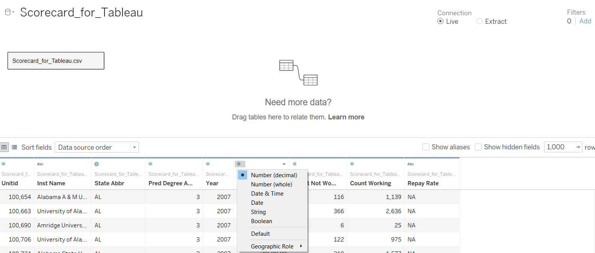
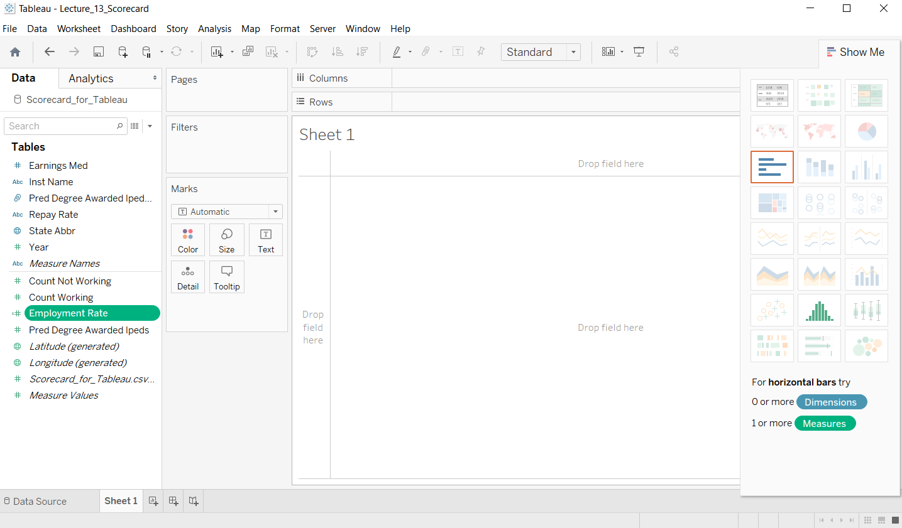
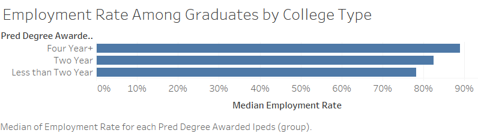
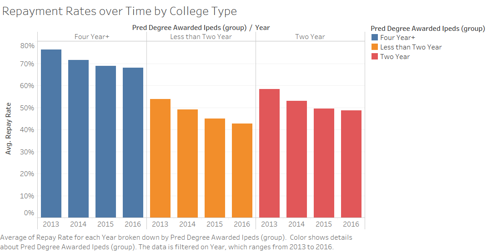
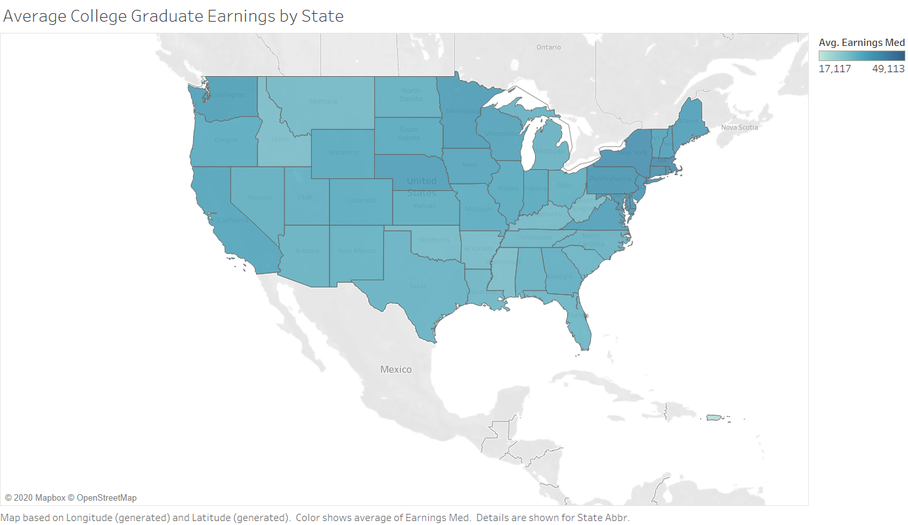
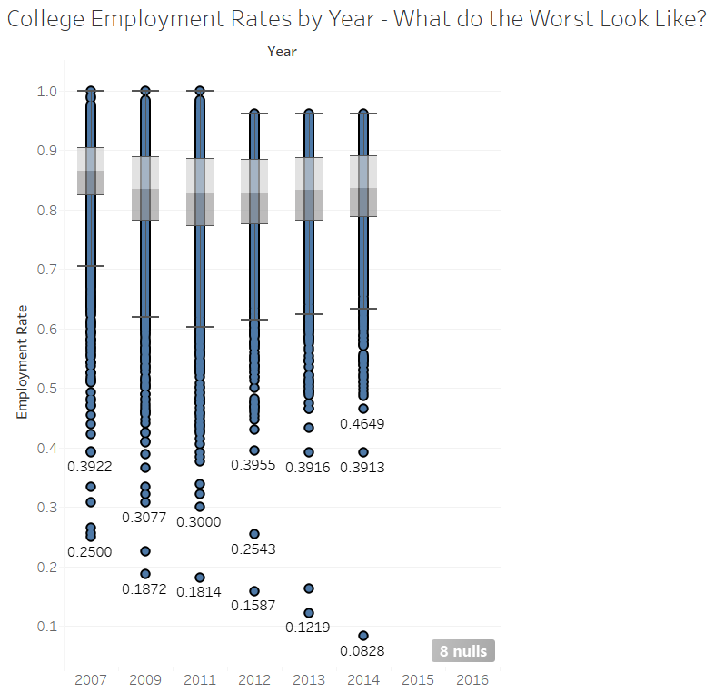

```{r setup, include=FALSE}
knitr::opts_chunk$set(echo = FALSE, warning = FALSE, message = FALSE)
library(tidyverse)
library(knitr)
library(paletteer)
library(ggrepel)
library(directlabels)
library(gghighlight)
library(lubridate)

rinlinevarname <- function(code){
  html <- '<code  class="r">``` `CODE` ```</code>'
  sub("CODE", code, html)
}
```


## Graphing Software

```{r, results = 'asis'}
cat("
<style>
.reveal section img {
  border: none !important;
  box-shadow: none;
}
</style>")
```

- A lot of this class has been spent going over **ggplot2** in R
- Today we'll be going over Tableau
- (not to mention all we leave out - PowerBI, **matplotlib**/**Seaborn** in Python, every stats package other than R, automated stuff like Azure, etc. etc.)
- Why introduce these different tools, and what do they do?

## Graphing Software

- It's most important that we understand the underlying concepts of data communication
- But also we have to know how to implement those concepts
- And since so much of this is subjective, we have to practice, practice, practice. Working with the software is a requirement!
- Plus, stuff like learning the grammar of graphics, baked into **ggplot2**, can help strengthen those concepts

## Graphing Software

- R: High-power but with a learning curve. **Great for any size data sets**, **great for summarizing**, **endless customization**. **Great for contrasting groups**
- **If the data isn't already in graphable format, R itself is crucial for cleaning/formatting it**
- Supports **dashboards**, **notebooks**, **interactivity**, and **animation**
- Until you're used to it, **a lot of work to get going though!**
- Because there is **direct access to the underlying pieces of the graph**, there is no better tool for making **one beautiful image**
- Requires additional work for working with enormous databases

## Graphing Software

- Tableau: High-power, with less learning curve, but more constrained. **Great for any size data sets**, **great for summarizing**, **great for contrating groups**
- Great at making a **host of graphs at once to explore a data set thoroughly**
- It can **smartly suggest for you what kind of graph to use**
- Built-in easy to work with tools for **enormous databases** and **dashboards**
- Everything is **interactive by default**
- **Easier than R** and also less work but **deep customization a bit more difficult**

## The Canned-Coded Scale

- It is extremely common in software to have to choose between a deeper, more customizable option (such as coding something in **ggplot2**) or a more canned, one-click-does-it option (like Tableau or Excel)
- Until you're very familiar with the coding option, the canned option will be faster and easier...
- *IF* the thing you want to do is something the canned-software authors anticipated and decided to make easy
- If it's not, it will usually be *much* harder than just coding the thing up

## The Canned-Coded Scale

- Tableau is a very cool tool and I encourage you to use it (as are other more canned systems like PowerBI, Azure ,etc.)
- But don't be surprised when you start thinking "hmm but what if my visualization was different in THIS nonstandard way" and start Googling, only to find it's a fourteen-step process that doesn't actually work
- Using Tableau for the simple stuff, and immediately shifting to code for anything that's not stock-standard, is a decent strategy!
- That said, let's explore Tableau

## Tableau

- As opposed to (the way we've used) R, Tableau uses *database* logic - it sends the calculation **to the data** rather than bringing the data to the calculation
- So we'll have "connections" to data rather than bringing data in; also, if data updates, so will Tableau
- And the output we have will include underlying data, but only our calculations of the data.
- Let's walk through some usage of Tableau


## Importing Data

- A connection can be "Live" (database-like) or an "Extract" (bring it in!)
- Specify how variables should be read by clicking on them
- Tableau will guess as much as possible
- Unlike R we do filtering, selection, and recoding at THIS step
- Strongly recommended to do all data-cleaning in R BEFORE importing to Tableau - Tableau *can* clean data but it's a real drag

## Importing Data

```{r}

```

## Importing Data

- NAs can make it think it's a string, let's tell it earnings is a number
- Let's group `pred_degree_awarded_ipeds`: 1 = less-than-two-year college, 2 = two-year, 3 = four-year+
- Could also do a filter here, or only select certain variables
- Or create variables calculated from others - let's make an employment rate

## The Tableau Screen

- Dimensions (categorical) and measures (continuous numeric) on the left. Tableau really cares about discrete vs. continuous.
- Columns and Rows areas to drag to
- (single image export: Worksheet $\rightarrow$ Copy image)
- "Show me" default graphs on the right. Decent for initial exploration but generally not what you want to work with

---

```{r}

```


## Working with Variables

- To start making a graph, think about what you want on the x-axis (column) or y-axis (row)
- How it treats a variable can then be manipulated: discrete vs. continuous and measure vs. dimension. Measures get aggregated/summarized in some specified way, dimensions don't!
- Plenty of aggregation options for continuous variables

## Working with Variables

- Also click the variables to do things like sort the order or turn them "dual axis" (two variables on the same axis)
- In general, like Excel, click what you want to edit, like axis titles
- Note with a graph we can find the data that goes into it
- Some variables like "Measure Names" can become their own "shelf" like column/row for more complex diagrams

## Common Problems in Tableau

- If something's not working, check whether your variable has the correct continuous/discrete measure/dimension settings
- Note that sometimes "grouped" variables don't work the same as regular categorical variables - make life easier by just making them strings grouped as you like in R and import them
- Did you try Googling to see how you can do (nonstandard thing X)?

## Basic Example

- Let's remake it!

```{r}

```

## Basic Example

- This one is trickier!

```{r}

```

## Basic Example

- Let's do this one together: what should be in rows and columns here?

```{r}

```

## Another Example

- We can also set labels by clicking-and-labeling
- Let's replicate the graph on the next page

---

```{r}

```

## And Explore

- Click around and make your own graph
- See what kinds of customizations you can do
