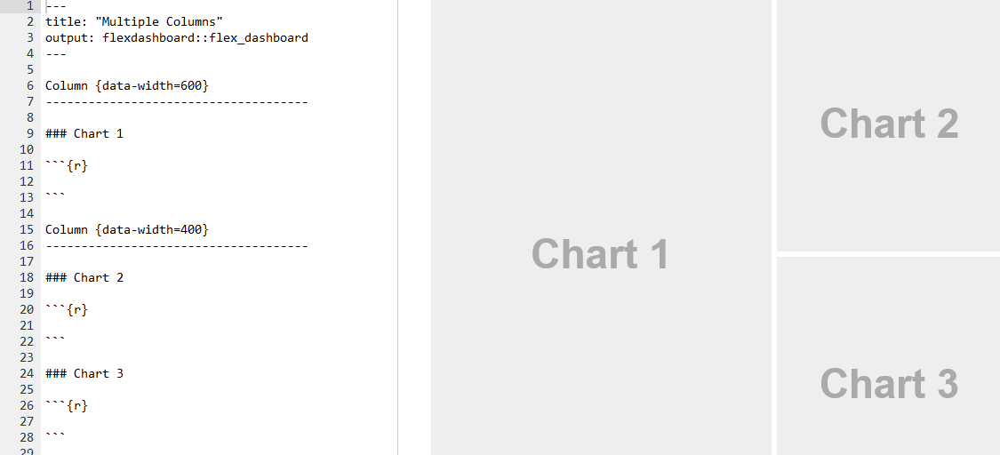
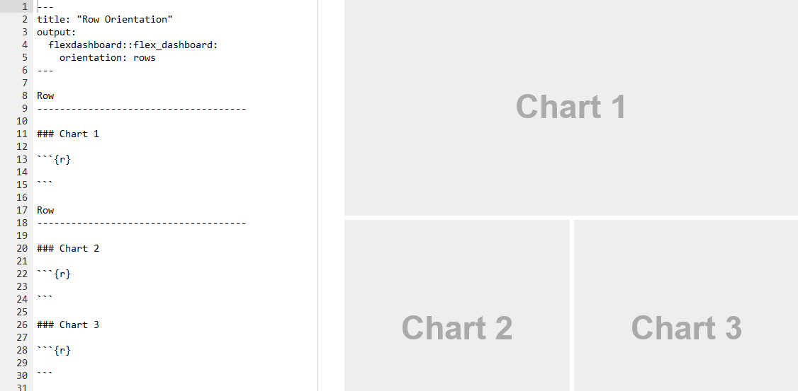

```{r setup, include=FALSE}
knitr::opts_chunk$set(echo = FALSE, warning = FALSE, message = FALSE)
library(tidyverse)
library(paletteer)
options("kableExtra.html.bsTable" = T)
rinlinevarname <- function(code){
  html <- '<code  class="r">``` `CODE` ```</code>'
  sub("CODE", code, html)
}
```


## Dashboards in R

```{r, results = 'asis'}
cat("
<style>
.reveal section img {
  border: none !important;
  box-shadow: none;
}
</style>")
```

- I'll tell you up front that doing a dashboard in R is going to be more work than doing one in Tableau
- So why bother?
- As always, there is more flexibility and control in R
- Plus you get a lot more control over cleaning and manipulating the underlying data
- Plus, for doing the basic stuff it's not too hard
- And it's easier to host online without access to paid Tableau versions

## Plus...

- R dashboard provide you access to a huge range of free premade graphical tools through htmlwidgets
- See the [htmlwidgets gallery](https://www.htmlwidgets.org/showcase_leaflet.html)
- Good for everything, but the maps do really stand out
- As you learn these tools you can include them not just in dashboards but in RMarkdown docs, too
- And also, it's not just htmlwidgets, but also Shiny!

## Shiny

- Shiny is more internal to R than htmlwidgets; it's an R-specific interactive site builder
- You can add user controls to allow them to change parameters around and see the results
- Great for dashboards, but even beyond that, learning Shiny for the purpose of dashboards will also give you the tools to create data-based *apps* that you can upload on their own
- Super cool stuff you can do if you branch out with this!

## On to dashboards

- There are two approaches to doing dashboards in R. One is Shiny-focused, and the other is htmlwidgets focused (but lets you include Shiny stuff)
- We'll be going with the latter, as it's easier, but the Shiny one is good too.
- Our approach will be to use **flexdashboard**
- Install **flexdashboard** with `install.packages('flexdashboard')`
- Then you can open a new Flex Dashboard by going File $\rightarrow$ New File $\rightarrow$ R Markdown $\rightarrow$ From Template $\rightarrow$ Flex Dashboard.
- Plenty of info on [https://rmarkdown.rstudio.com/flexdashboard/](https://rmarkdown.rstudio.com/flexdashboard/)

## What Do We See?

```{r}

```

## What Do We See?

- Up top is the YAML - we know this from working with RMarkdown docs. Basic info about the doc itself
- Then we have our *layout structure* - columns of stuff, with multiple graphs per columns
- We can if we prefer lay things out row-wise (see next slide), and "storyboard" where it goes from page to page like a flipbook
- Then within each column we have our graphs, labeled with three hashes

## Row orientation

```{r}

```

## Content

- We can of course fill those charts with regular-ol **ggplot2** output
- (or **gganimate**, or whatever else produces an image file)
- Or Shiny stuff, which we'll get to next time
- But also there are a bunch of packages designed to output **htmlwidgets** that we can include! Many of them look real nice
- Let's peruse: [The HTMLWidgets R Gallery](http://gallery.htmlwidgets.org/)


## Plotly

- One of the easiest to use, and one you'll reach for very frequently, is **plotly**
- Plotly is a JavaScript-based graphing tool with built-in interactivity
- And, super conveniently, you don't really need to *do anything new* to use it
- Just toss your regular **ggplot2** object into `ggplotly` from the **plotly** package and you're ready to go
- (**ggiraf** is a similar **ggplot2**-but-interactive approach but with a little more control and flexibility, but requires changing the original **ggplot2** code to add interactive elements. Up to you!)

## Plotly

```{r, echo = TRUE}
p <- mtcars %>% 
  mutate(CarName = row.names(mtcars),
    Transmission = factor(am, labels = c('Automatic','Manual'))) %>%
  ggplot(aes(x = mpg, y = hp, color = Transmission, label = CarName)) + 
  theme_minimal() + 
  theme(text = element_text(size = 15, family = 'serif')) + 
  geom_point() +
  labs(x = 'Miles per Gallon', y = "Horsepower",
       title = 'Miles per Gallon vs. Horsepower by Transmission Type') +
  guides(color = FALSE) + 
  scale_color_paletteer_d('yarrr::google') + 
  annotate(geom = 'label', x = 20, y = 300, label = 'Notice the Downward Trend')
```

## Plotly

- Most things will translate right over; for others we might need to look a little bit into the **plotly** docs - notice how the legend will still show up despite us turning it off, and the annotation doesn't carry over.

```{r, echo = TRUE}
plotly::ggplotly(p)
```

## Material

- When it comes to any complex programmatic system like this, you always want to look at the docs at least a little
- Let's just spend some time walking through [https://rmarkdown.rstudio.com/flexdashboard/](https://rmarkdown.rstudio.com/flexdashboard/) if only to see what's possible and what we need to know
- Then come back here

## Practice

- Open a Flex Dashboard template
- Load any data set (in the Dashboard code)
- Make a Flex Dashboard and set its `theme`
- Include three graphs: one regular **ggplot2**, that same graph again in **plotly** version with `ggplotly`, and one graph other than a Plotly from [http://gallery.htmlwidgets.org/](http://gallery.htmlwidgets.org/)
- If you can make it look nice that's great! But focus more on getting it to work.