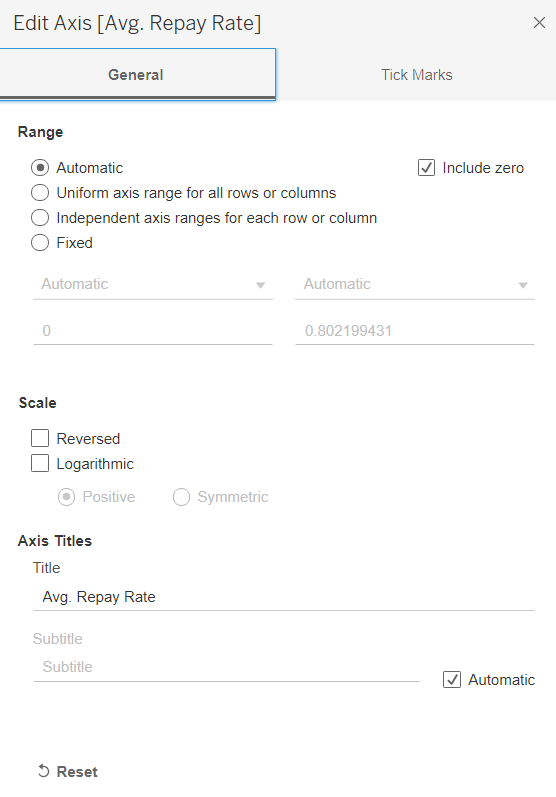
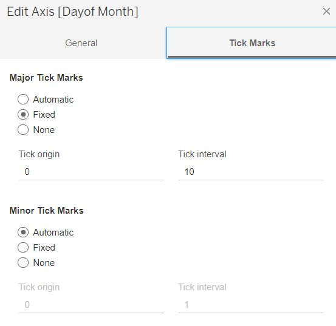
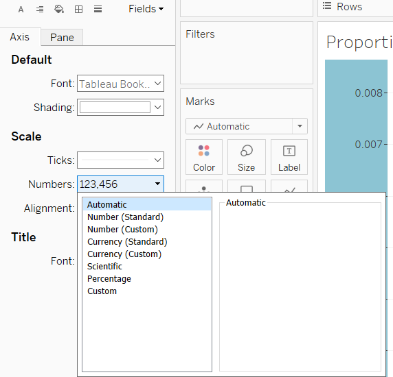
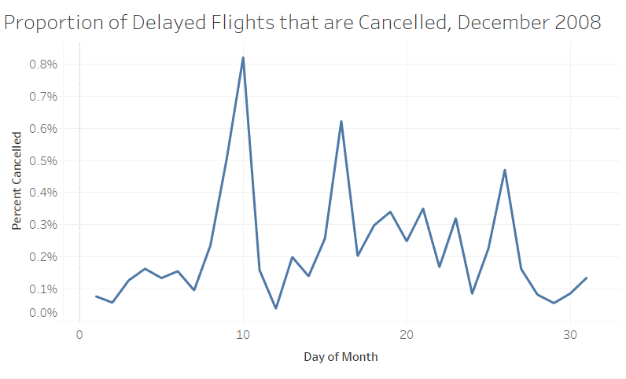
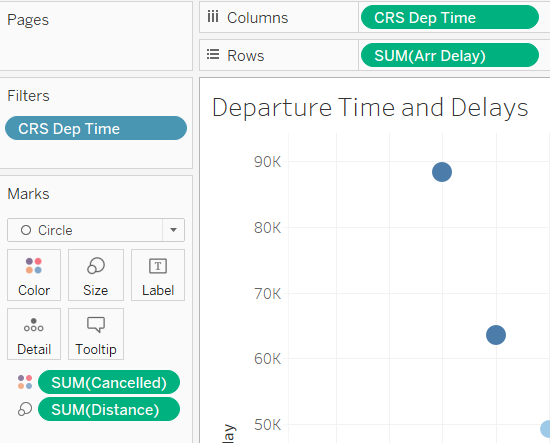
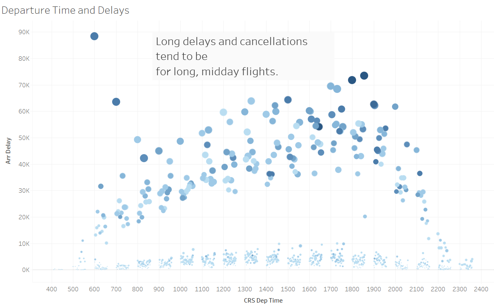
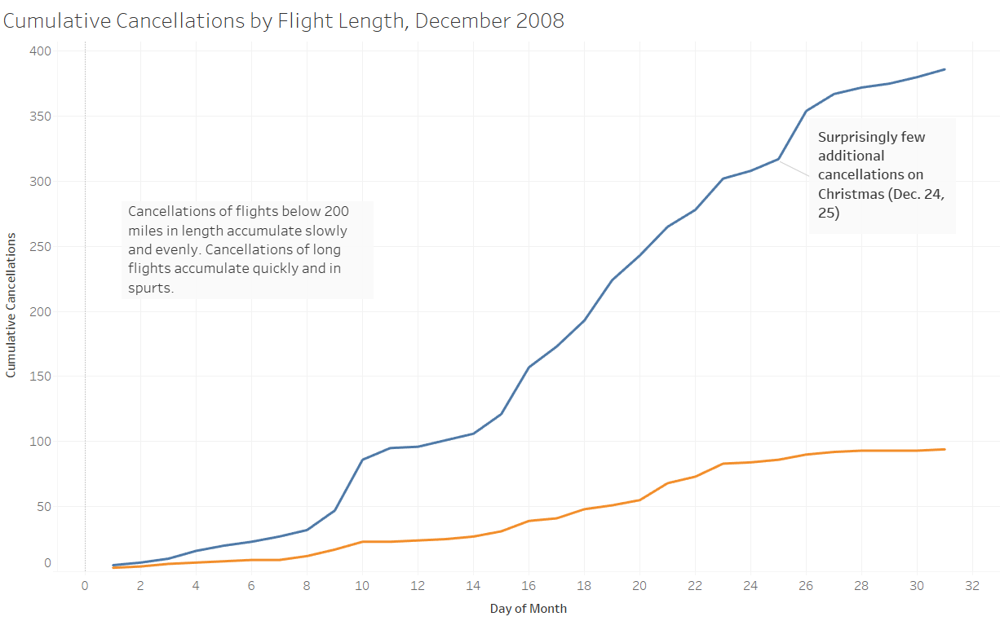
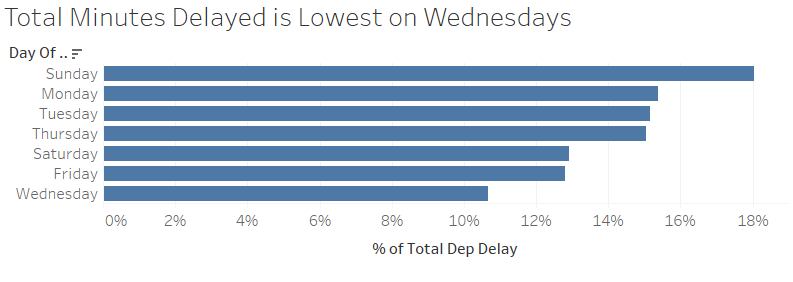

```{r setup, include=FALSE}
knitr::opts_chunk$set(echo = FALSE, warning = FALSE, message = FALSE)
library(tidyverse)
library(knitr)
library(paletteer)
library(ggrepel)
library(directlabels)
library(gghighlight)
library(lubridate)

rinlinevarname <- function(code){
  html <- '<code  class="r">``` `CODE` ```</code>'
  sub("CODE", code, html)
}
```


## Tableau

```{r, results = 'asis'}
cat("
<style>
.reveal section img {
  border: none !important;
  box-shadow: none;
}
</style>")
```

- Last time we got some basic graphs going and got familiar with the software
- This time we'll go a little deeper!
- First, working our way around the decoration and customization options
- Then, making some more complex graphs with Table Calculations and Shelves

## Decoration

- We can adjust the presentation of most elements of the graph by double clicking on them, Excel style
- For example, axes
- From here we can adjust tick marks, scale, consistency of scale across multi-part graphs, and numerical formatting, as well as things like "include 0 on the axis or no?"

---

```{r}

```

## Formatting Numbers

- We can also see on the left when we click on an axis the "Scale" segment
- We can set things like percentages being .1 or 10%, or the units of the variable (like $)
- (If you're having trouble, RIGHT-click the axis and hit Format)

## Decoration

- Let's take the example worksheet and walk through adjusting the axis
- Look at Sheet 1
- Make the y-axis tick marks percentages with one decimal place
- And make the x-axis only have ticks on days 0, 10, 20, 30.
- Also change axis titles to "Day of Month" and "Percent Cancelled

## Decoration

```{r}

```

## Decoration

```{r}

```


## The Result

```{r}

```

## Colors

- We can make a variable be distinguished by color by dragging it to the Color part of the Marks pane
- (This will add color to the *variable*, not its position, so drag it from the left variables pane, not away from its column/row if it's there!)
- Then click Color to manually adjust the colors used or pick a palette, or pick opacity

## Other Axes

- Just like the axes in our **ggplot2** `aes()`thetic, we can similarly drag variables to be used on the Size, Label, etc. axes
- Having variables *just* on these axes and not Column or Row will create different kinds of output - Labels-only will give a table, for example
- Also, not really an axis, but by clicking data points we can zoom in on them, exclude them, or exclude others
- The Marks card is the home of these, and we can edit things directly there

## Decoration

- On Sheet 2
- Let's color our data by Cancelled
- And make the size differ by Distance
- And exclude flights before 3AM
- Make an annotation of an area (What story does this tell?)
- And title it "Departure Times and Delays"

## Decoration

```{r}

```

---

```{r}

```


## Table Calculations

- By clicking the down-arrow on a numeric variable on an axis, we can change it from being presented raw to being presented relative to other stuff
- We already covered how we can make it a calculation/summary: mean, median, etc.
- Table Calculations extend the analysis to make the presentation *relative to other calculations*
- i.e. changing a line graph from the values to growth-from-previous-period, or moving average
- Or making a bar graph percent-of-total, or rank


## Table Calculations

- Let's change the bar graph from count to percent of total
- Now you change the line graph from percent to change-since-previous
- (Also, while we're at it, add data point labels to the line graph)
- (And right-click an empty space to add an annotation)

## Other Down-Arrow Adjustments

- We can also use this down-arrow to sort
- For example, sorting a bar by its height, or the value of another variable
- You can do this using another variable directly, or a table calculation (like a COUNT) of a variable

## Getting More Complex

- If you want to do more detailed adjustments to variables, things like complex created variables, you can do so with Create Calculated Field
- But this does require that you learn the Tableau coding system. You can Google for how to do stuff, but it's often easier just to do it in R and export to Tableau (same as with joins/etc.)
- One exception is if you just want a basic condition checked
- `IF [X] == Value THEN "A" ELSE "B" END`
- Can also use `ELSEIF` for more-flexible grouped variables than with Groups

## Animation

- You can do basic animations by adding a variable to "Pages"; this will make a slideshow going through each value
- This is only one kind of animated graph but it is very easy to make! Let's try one.

## Sharing Work

- Tableau workbooks can be saved and shared
- If you want them to be interactive for someone without Tableau, have them use [Tableau Reader](https://www.tableau.com/products/reader)
- Or just a static image with Worksheet $\rightarrow$ Export
- Or make a dashboard (we'll get to that next time)!


## Sharing Work

- If you're sharing with someone who has Tableau, and your data isn't enormous, use a **packaged workbook**.
- This will bundle the data set in with your work so they can actually open it, making a `.twbx` file
- If you don't do this and just send a `.twb` then they won't be able to see your work at all!!
- If you turn in your Tidy Tuesday homework as a `.twb` I won't be able to read it and you'll have to resubmit.

## Practice

- Let's walk through creating the graph on the following slide...

---

```{r}

```

## Practice

- Now you recreate this graph

```{r}

```


## Practice

- Make your own graph with this data