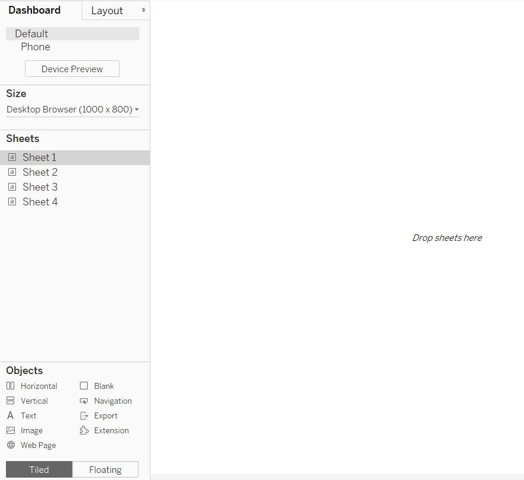
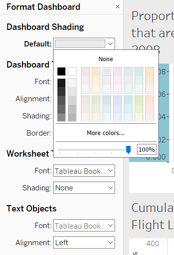
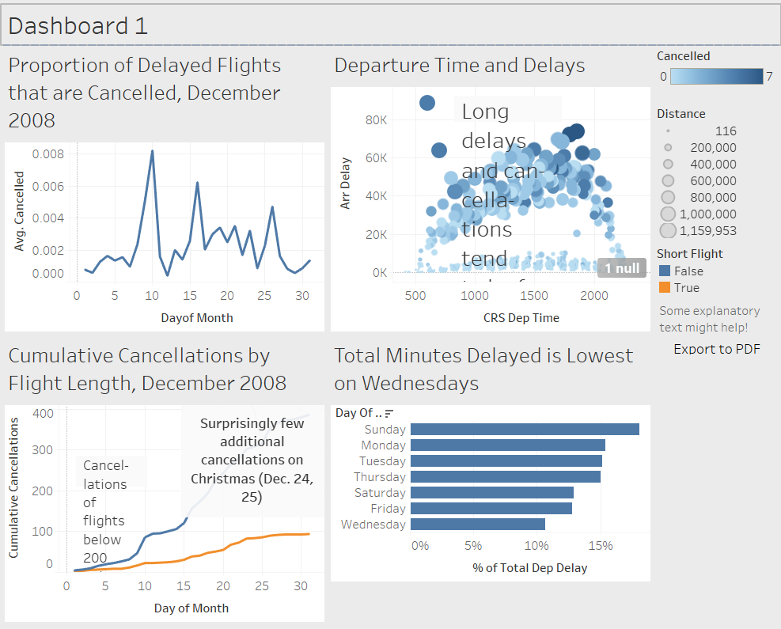

```{r setup, include=FALSE}
knitr::opts_chunk$set(echo = FALSE, warning = FALSE, message = FALSE)
library(tidyverse)
options("kableExtra.html.bsTable" = T)
rinlinevarname <- function(code){
  html <- '<code  class="r">``` `CODE` ```</code>'
  sub("CODE", code, html)
}
```


## Dashboards in Tableau

```{r, results = 'asis'}
cat("
<style>
.reveal section img {
  border: none !important;
  box-shadow: none;
}
</style>")
```

- Tableau is designed for dashboards, and they make it easy
- Most of what we'll cover today you could probably figure out yourself by clicking "New Dashboard" at the bottom and clicking around
- So we'll keep this brief and then get to trying stuff out

## Creating a Dashboard

- Create your visualizations and tables
- Then down at the bottom, next to the Sheets, there's a + icon for "New Dashboard"
- Click it!

## Adding Worksheets to the Dashboard

- From here you'll see:
- The Layout option (in a sec)
- Your worksheets - drag them in!
- Options at the bottom to add navigation, images, text, web pages

## Adding Worksheets to the Dashboard

```{r}

```

## Layout

- Tableau Dashboards can be laid out for desktop, mobile, or tablet
- Check your Size options, and try Device Preview with a few things on
- Also check the Layout tab for other options
- Keep the audience in mind, and whether some visualizations might not translate to tiny sizes!

## Formatting

- Format $\rightarrow$ Dashboard brings up the formatting panel for things like overall coloring, fonts, etc.
- You can also format the individual worksheets included by clicking on them as normal
- Any re-decoration you want to do at this point is on the table!

## Formatting

```{r}

```

## Considerations for Dashboards

If you're planning to end up with a dashboard...

- Hold off on annotations until the end; what looks good on a single image might get cramped on multiples
- Consider how you might reduce the number of legends required to understand things. Lots of legends can get confusing
- Try to make dashboard and worksheet formatting consistent
- Use a grid layout! Don't get wild
- Consider including the "Export to PDF" option

---

```{r}

```

## Sharing Dashboards

- Save as an image (no interactivity) with Dashboard $\rightarrow$ Export Image
- Send the workbook which can be opened with Tableau or (free) Tableau Reader
- Tableau Server and Tableau Online store the workbook online - automatically updated as necessary. Users can also subscribe for update notifications. Requires paid license

## Let's Do This

- See the provided workbook file Lecture_18_Oster_Data
- This contains data from NHANES, the National Health and Nutrition Examination Survey

## Let's Do This

- Specifically, an extract from Oster (2020), who was trying to tell the following story:
    - From 1999-2004, Vitamin E was a recommended supplement
    - Before 1999 and after 2004, it wasn't, and was actually recommended against
    - From 1999-2004, people who pay the most attention to their health will be more likely to follow the recommendation, i.e. take Vitamin E
    - So, during that time, the relationship between taking Vitamin E and health outcomes like mortality should be stronger
- Try to tell this story in a dashboard!
- Careful: how can you show that a *relationship* gets stronger or weaker over time? This is trivariate!